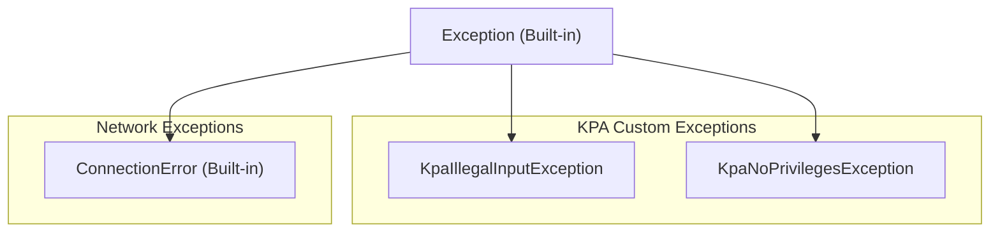
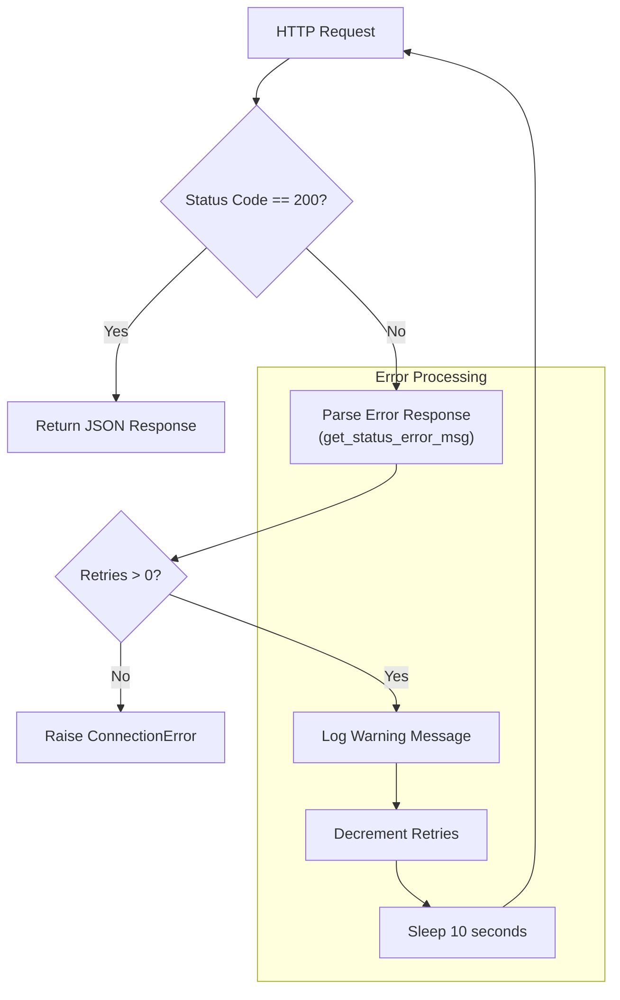

<!-- Source: debater-early-access-program-sdk-Deepwiki.md -->
<!-- Section: Error Handling and Exception Types -->
<!-- Lines: 3086-3164 -->

## Error Handling and Exception Types

The SDK implements a layered error handling approach with custom exceptions for specific error conditions and generic `ConnectionError` for network-related issues.

### Custom Exception Hierarchy

The SDK defines custom exceptions for specific error conditions:

### Exception Types

| Exception | Purpose | Usage |
|-----------|---------|-------|
| `KpaIllegalInputException` | Invalid input parameters | Thrown when user passes illegal input to KPA methods |
| `KpaNoPrivilegesException` | Insufficient privileges | Thrown when user lacks privileges for admin operations |
| `ConnectionError` | Network/HTTP errors | Raised by `AbstractClient.do_run()` for communication failures |

**Sources:** [debater_python_api/api/clients/key_point_analysis/KpaExceptions.py:2-12]()

### Error Handling in HTTP Communication

The `AbstractClient.do_run()` method implements robust error handling with retries:

**Sources:** [debater_python_api/api/clients/abstract_client.py:58-88]()

### Debug Support

The SDK includes debugging capabilities through request dumping when `dump_on_fail=True`:

- Failed requests are serialized to pickle files with timestamp
- Files contain URL, JSON payload, and headers
- Static method `run_client_from_dump()` can replay failed requests

**Sources:** [debater_python_api/api/clients/abstract_client.py:71-76](), [debater_python_api/api/clients/abstract_client.py:108-117]()

