<!-- Source: debater-early-access-program-sdk-Deepwiki.md -->
<!-- Section: Core Architecture Pattern -->
<!-- Lines: 3291-3352 -->

## Core Architecture Pattern

The SDK follows a layered architecture with three primary components: a factory layer for client instantiation, an abstract base class providing common functionality, and specialized client implementations for each service.

### Client Factory System

The `DebaterApi` class serves as the central factory for creating client instances. This provides a unified entry point and ensures consistent configuration across all services.

```mermaid
graph TD
    subgraph "Client Factory Layer"
        DebaterApi["DebaterApi"]
    end
    
    subgraph "Client Creation Methods"
        GetKeypoints["get_keypoints_client()"]
        GetArgQuality["get_argument_quality_client()"]
        GetClaimDetect["get_claim_detection_client()"]
        GetEvidence["get_evidence_detection_client()"]
        GetClustering["get_clustering_client()"]
        GetClaimBounds["get_claim_boundaries_client()"]
        GetProCon["get_pro_con_client()"]
        GetNarrative["get_narrative_generation_client()"]
        GetTermRelater["get_term_relater_client()"]
        GetTermWikifier["get_term_wikifier_client()"]
        GetThemeExtraction["get_theme_extraction_client()"]
        GetIndexSearcher["get_index_searcher_client()"]
    end
    
    subgraph "Client Instances"
        KpAnalysisClient["KpAnalysisClient"]
        ArgumentQualityClient["ArgumentQualityClient"]
        ClaimDetectionClient["ClaimDetectionClient"]
        EvidenceDetectionClient["EvidenceDetectionClient"]
        ClusteringClient["ClusteringClient"]
        ClaimBoundariesClient["ClaimBoundariesClient"]
        OtherClients["..."]
    end
    
    DebaterApi --> GetKeypoints
    DebaterApi --> GetArgQuality
    DebaterApi --> GetClaimDetect
    DebaterApi --> GetEvidence
    DebaterApi --> GetClustering
    DebaterApi --> GetClaimBounds
    DebaterApi --> GetProCon
    DebaterApi --> GetNarrative
    DebaterApi --> GetTermRelater
    DebaterApi --> GetTermWikifier
    DebaterApi --> GetThemeExtraction
    DebaterApi --> GetIndexSearcher
    
    GetKeypoints --> KpAnalysisClient
    GetArgQuality --> ArgumentQualityClient
    GetClaimDetect --> ClaimDetectionClient
    GetEvidence --> EvidenceDetectionClient
    GetClustering --> ClusteringClient
    GetClaimBounds --> ClaimBoundariesClient
```

**Sources:** [debater_python_api/examples/keypoints_example.py:4-5](), [debater_python_api/integration_tests/api/clients/ServicesIT.py:26](), [debater_python_api/integration_tests/api/clients/ServicesIT.py:30](), [debater_python_api/integration_tests/api/clients/ServicesIT.py:47](), [debater_python_api/integration_tests/api/clients/ServicesIT.py:64](), [debater_python_api/integration_tests/api/clients/ServicesIT.py:81](), [debater_python_api/integration_tests/api/clients/ServicesIT.py:93]()

