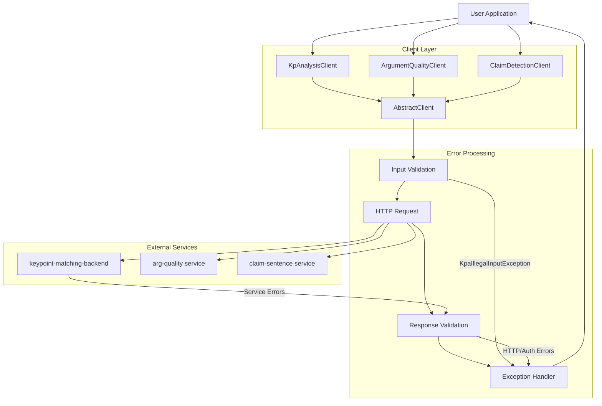

<!-- Source: debater-early-access-program-sdk-Deepwiki.md -->
<!-- Section: Error Handling Patterns Across Clients -->
<!-- Lines: 3640-3708 -->

## Error Handling Patterns Across Clients

The SDK follows consistent error handling patterns across all service clients that inherit from `AbstractClient`. This ensures predictable behavior and uniform error reporting.

### Client-Level Error Handling Flow

Sources: [debater_python_api/api/clients/key_point_analysis/KpaExceptions.py:2-12]()

### Common Error Scenarios

The SDK handles several categories of errors that can occur during operation:

| Error Category | Typical Causes | Handling Strategy |
|---|---|---|
| **Input Validation** | Invalid parameters, malformed data | Raise `KpaIllegalInputException` before service calls |
| **Authentication** | Invalid credentials, expired tokens | Return authentication error with clear message |
| **Authorization** | Insufficient permissions | Raise `KpaNoPrivilegesException` for admin operations |
| **Network Issues** | Connection failures, timeouts | Implement retry logic with exponential backoff |
| **Service Errors** | Backend service unavailable | Propagate service status with context information |
| **Data Processing** | Invalid response format, parsing errors | Provide detailed error context for debugging |

