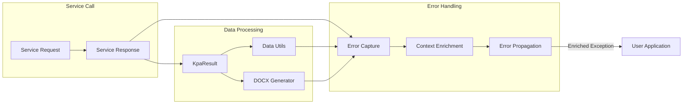

<!-- Source: debater-early-access-program-sdk-Deepwiki.md -->
<!-- Section: Error Propagation and Context -->
<!-- Lines: 3709-3750 -->

## Error Propagation and Context

Error handling in the SDK maintains context information to help developers debug issues effectively. The error propagation follows a consistent pattern from service calls through data processing to user applications.

### Error Context Flow

Sources: [debater_python_api/api/clients/key_point_analysis/KpaExceptions.py:2-12]()

