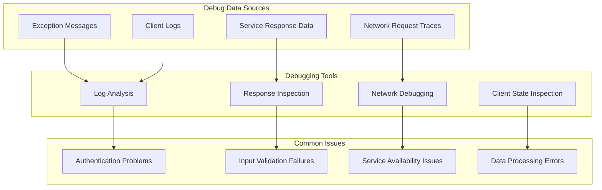

<!-- Source: debater-early-access-program-sdk-Deepwiki.md -->
<!-- Section: Debugging Approaches -->
<!-- Lines: 3786-3853 -->

## Debugging Approaches

The SDK provides several mechanisms to help developers debug issues:

### Debug Information Sources

Sources: [debater_python_api/api/clients/key_point_analysis/KpaExceptions.py:2-12]()

### Troubleshooting Common Issues

1. **Input Validation Errors**: Check parameter types and formats before making service calls
2. **Authentication Failures**: Verify credentials and service endpoint configurations
3. **Permission Errors**: Ensure user has appropriate privileges for admin operations
4. **Network Issues**: Check connectivity to IBM Debater service endpoints
5. **Service Unavailability**: Implement retry logic with appropriate delays

The SDK's exception hierarchy and error handling patterns provide a foundation for building robust applications that can gracefully handle various failure scenarios while providing meaningful feedback to users and developers.22:T1aaf,# Utilities and Helpers

Relevant source files

The following files were used as context for generating this wiki page:

- [debater_python_api/api/clients/key_point_analysis/utils.py](debater_python_api/api/clients/key_point_analysis/utils.py)
- [debater_python_api/utils/kp_analysis_utils.py](debater_python_api/utils/kp_analysis_utils.py)

This document covers the utility functions, data processing helpers, and common operations used throughout the Debater Early Access Program SDK. These utilities provide foundational support for data transformation, file operations, output formatting, and other common tasks across the SDK components.

For information about SDK architecture patterns and client design, see [SDK Architecture](#5.1). For error handling utilities and exception management, see [Error Handling](#5.2).

