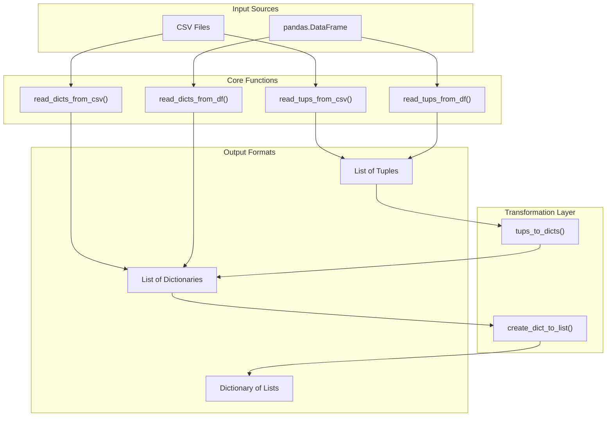

<!-- Source: debater-early-access-program-sdk-Deepwiki.md -->
<!-- Section: Data Processing Utilities -->
<!-- Lines: 3913-3974 -->

## Data Processing Utilities

### CSV and DataFrame Operations

The data processing utilities handle conversion between different data formats:

**Data Format Conversion Pipeline**

*Sources: [debater_python_api/api/clients/key_point_analysis/utils.py:9-41]()*

### Data Transformation Functions

| Function | Purpose | Input | Output |
|---|---|---|---|
| `create_dict_to_list()` | Convert tuples to grouped lists | `List[(key, value)]` | `Dict[key, List[value]]` |
| `read_tups_from_df()` | Extract tuples from DataFrame | `pandas.DataFrame` | `(tuples, columns)` |
| `tups_to_dicts()` | Convert tuples to dictionaries | `(tuples, columns)` | `List[Dict]` |
| `trunc_float()` | Truncate float precision | `(float, decimals)` | `float` |

*Sources: [debater_python_api/api/clients/key_point_analysis/utils.py:9-51]()*

