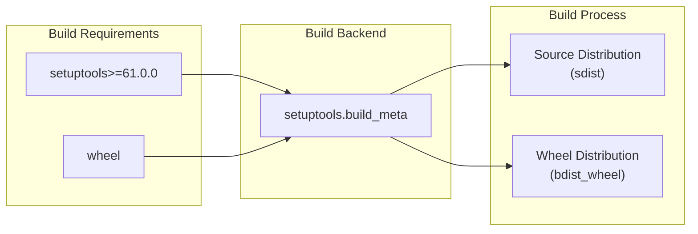

<!-- Source: debater-early-access-program-sdk-Deepwiki.md -->
<!-- Section: Build System Configuration -->
<!-- Lines: 4333-4367 -->

## Build System Configuration

The project uses a modern Python build system based on setuptools and wheel, configured through the `[build-system]` section. This configuration follows PEP 517 standards for build system specification.

**Build System Components**

The build system configuration specifies:
- **Build Requirements**: `setuptools>=61.0.0` and `wheel` packages
- **Build Backend**: `setuptools.build_meta` for PEP 517 compliance
- **Minimum setuptools version**: 61.0.0 for modern packaging features

Sources: [pyproject.toml:3-5]()

