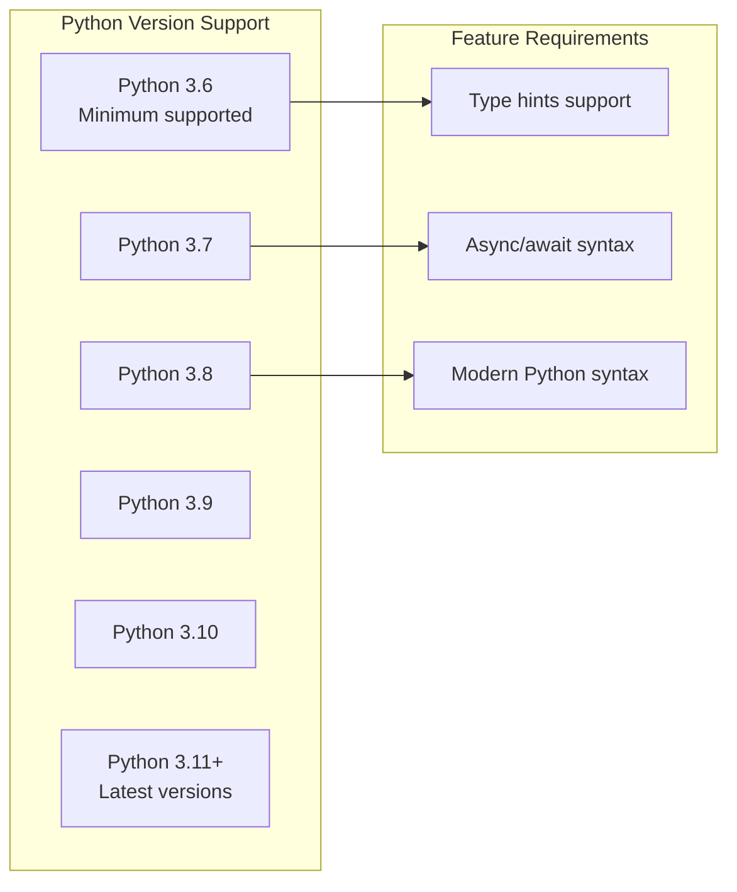

<!-- Source: debater-early-access-program-sdk-Deepwiki.md -->
<!-- Section: Python Version Requirements -->
<!-- Lines: 4437-4472 -->

## Python Version Requirements

The SDK requires Python 3.6 or higher, specified in the `requires-python` configuration. This ensures compatibility with modern Python features while maintaining broad compatibility.

**Python Version Compatibility**

The minimum Python version of 3.6 was chosen to:
- Support modern Python features used throughout the SDK
- Maintain compatibility with common enterprise Python environments
- Enable use of type hints and modern async/await syntax
- Support the dependency requirements of included packages

Sources: [pyproject.toml:29]()

