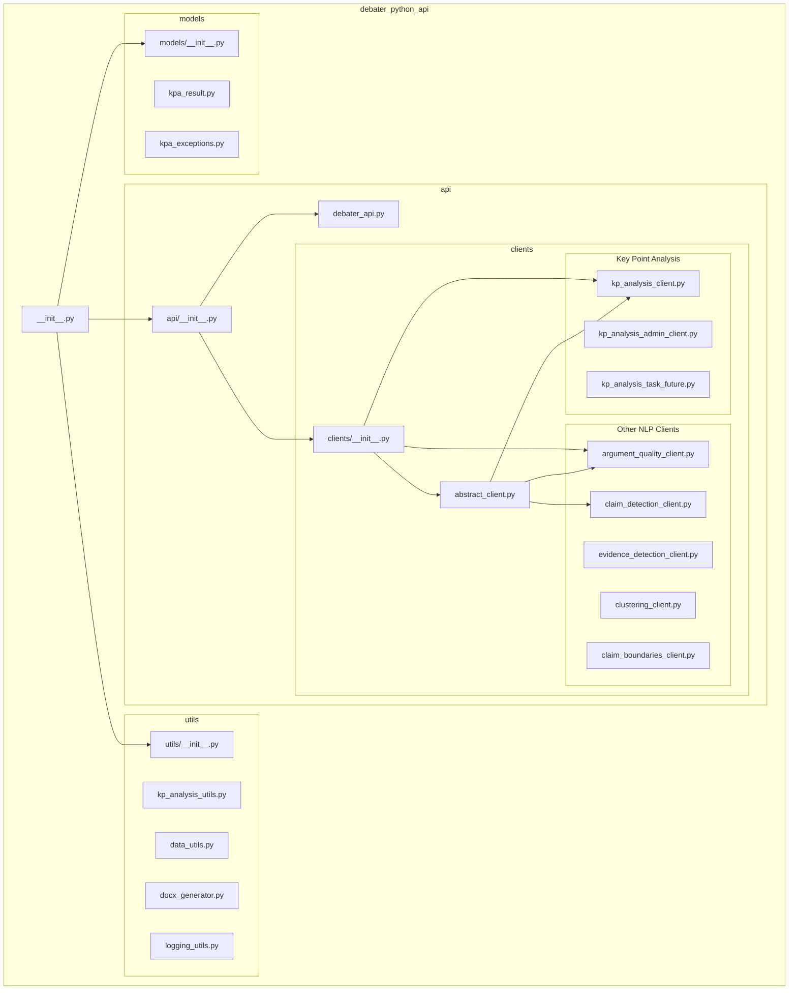

<!-- Source: debater-early-access-program-sdk-Deepwiki.md -->
<!-- Section: Top-Level Package Structure -->
<!-- Lines: 4544-4609 -->

## Top-Level Package Structure

**Package Structure Overview**: This diagram shows the hierarchical organization of the main package modules, with clear separation between API clients, utilities, and data models.

*Sources: [debater_python_api/__init__.py:1-1](), [debater_python_api/api/__init__.py:1-1](), [debater_python_api/api/clients/__init__.py:1-1]()*

