# Overview

<details>
<summary>Relevant source files</summary>

The following files were used as context for generating this wiki page:

- [README.md](README.md)
- [pyproject.toml](pyproject.toml)

</details>


This document provides a comprehensive overview of the Debater Early Access Program SDK, a Python client library for IBM's Project Debater API services. This overview introduces the SDK's architecture, core components, and main features to help developers understand how to integrate and use the various NLP services provided by IBM's Project Debater platform.

For detailed installation and configuration instructions, see [Getting Started](#2). For comprehensive documentation of the primary Key Point Analysis feature, see [Key Point Analysis](#3). For information about additional NLP services, see [Other NLP Services](#4).

## Purpose and Scope

The `debater_python_api` package serves as a unified Python SDK for accessing IBM's Project Debater Early Access Program services. The SDK provides programmatic access to multiple natural language processing capabilities, with Key Point Analysis as the primary feature, alongside argument quality assessment, claim detection, evidence detection, text clustering, and other NLP services.

The SDK is designed to handle authentication, request management, data processing, and result formatting for all supported Debater services, providing both low-level API access and high-level utility functions for common tasks.

Sources: [pyproject.toml:7-10](), [README.md:1-3]()

## Overall SDK Architecture

The SDK follows a layered architecture pattern with clear separation between client interfaces, data processing, and service communication:

### SDK Architecture Overview
```mermaid
graph TB
    subgraph "Client_Factory_Layer"
        DebaterApi["DebaterApi"]
    end
    
    subgraph "Abstract_Base_Layer"
        AbstractClient["AbstractClient"]
    end
    
    subgraph "Specialized_Clients"
        KpAnalysisClient["KpAnalysisClient"]
        KpAnalysisAdminClient["KpAnalysisAdminClient"]
        ArgumentQualityClient["ArgumentQualityClient"]
        ClaimDetectionClient["ClaimDetectionClient"]
        EvidenceDetectionClient["EvidenceDetectionClient"]
        ClusteringClient["ClusteringClient"]
        ClaimBoundariesClient["ClaimBoundariesClient"]
    end
    
    subgraph "Data_Processing_Layer"
        KpaResult["KpaResult"]
        KpAnalysisUtils["KpAnalysisUtils"]
        DataUtils["Data Utils"]
    end
    
    subgraph "Output_Generation"
        DocxGenerator["DOCX Generator"]
        CsvExporter["CSV Exporter"]
        JsonExporter["JSON Exporter"]
    end
    
    subgraph "External_Services"
        KpaService["keypoint-matching-backend.debater.res.ibm.com"]
        ArgQualityService["arg-quality.debater.res.ibm.com"]
        ClaimDetectionService["claim-sentence.debater.res.ibm.com"]
        EvidenceService["motion-evidence.debater.res.ibm.com"]
        ClusteringService["clustering.debater.res.ibm.com"]
        BoundariesService["claim-boundaries.debater.res.ibm.com"]
    end
    
    DebaterApi --> KpAnalysisClient
    DebaterApi --> ArgumentQualityClient
    DebaterApi --> ClaimDetectionClient
    DebaterApi --> EvidenceDetectionClient
    DebaterApi --> ClusteringClient
    DebaterApi --> ClaimBoundariesClient
    
    AbstractClient --> KpAnalysisClient
    AbstractClient --> KpAnalysisAdminClient
    AbstractClient --> ArgumentQualityClient
    AbstractClient --> ClaimDetectionClient
    AbstractClient --> EvidenceDetectionClient
    AbstractClient --> ClusteringClient
    AbstractClient --> ClaimBoundariesClient
    
    KpAnalysisClient --> KpaResult
    KpAnalysisClient --> KpaService
    KpAnalysisAdminClient --> KpaService
    ArgumentQualityClient --> ArgQualityService
    ClaimDetectionClient --> ClaimDetectionService
    EvidenceDetectionClient --> EvidenceService
    ClusteringClient --> ClusteringService
    ClaimBoundariesClient --> BoundariesService
    
    KpaResult --> KpAnalysisUtils
    KpAnalysisUtils --> DocxGenerator
    KpAnalysisUtils --> CsvExporter
    KpAnalysisUtils --> JsonExporter
    KpAnalysisUtils --> DataUtils
```

This architecture provides a consistent interface across all Debater services while allowing specialized functionality for each service type. The `DebaterApi` factory class serves as the primary entry point, while `AbstractClient` provides common functionality like authentication, HTTP communication, and error handling.

Sources: Based on architectural patterns described in context diagrams

## Key Components

### Core Client Infrastructure

| Component | Purpose | Key Classes |
|-----------|---------|-------------|
| Factory Pattern | Single entry point for all clients | `DebaterApi` |
| Base Client | Common functionality across all services | `AbstractClient` |
| Authentication | API key management and request signing | Built into `AbstractClient` |
| HTTP Communication | Request/response handling with retry logic | Built into `AbstractClient` |

### Primary Feature: Key Point Analysis

The Key Point Analysis system is the SDK's most comprehensive feature, providing:

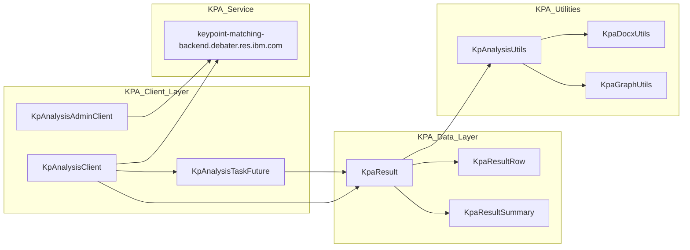

The KPA system supports domain management, comment upload, asynchronous job processing, and comprehensive result analysis with multiple output formats.

Sources: Based on KPA system architecture from context diagrams

### Additional NLP Services

The SDK provides specialized clients for various NLP tasks:

| Service | Client Class | Endpoint | Purpose |
|---------|-------------|----------|---------|
| Argument Quality | `ArgumentQualityClient` | `arg-quality.debater.res.ibm.com` | Score argument quality |
| Claim Detection | `ClaimDetectionClient` | `claim-sentence.debater.res.ibm.com` | Identify claims in text |
| Evidence Detection | `EvidenceDetectionClient` | `motion-evidence.debater.res.ibm.com` | Detect supporting evidence |
| Text Clustering | `ClusteringClient` | `clustering.debater.res.ibm.com` | Cluster similar sentences |
| Claim Boundaries | `ClaimBoundariesClient` | `claim-boundaries.debater.res.ibm.com` | Identify claim boundaries |

## Data Processing and Output Pipeline

The SDK provides comprehensive data processing capabilities with multiple output formats:

### Data Flow Architecture
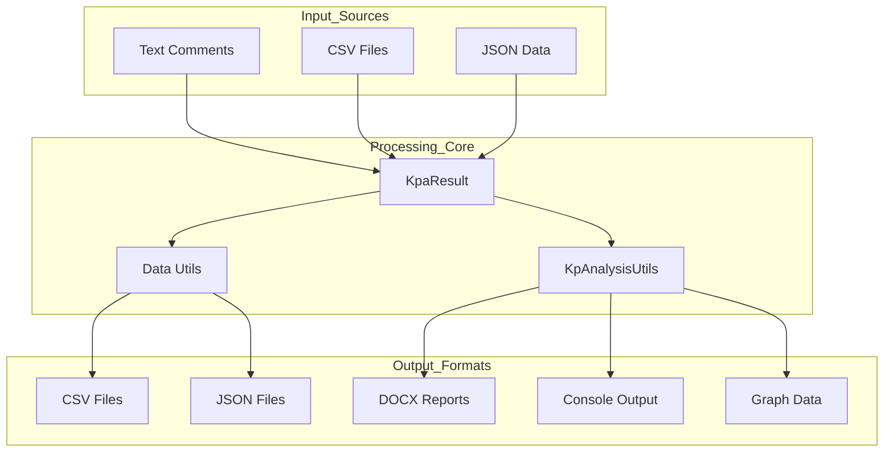

The data processing pipeline supports transformation between formats, statistical analysis, hierarchical data organization, and report generation.

Sources: Based on data processing architecture from context diagrams

## Dependencies and Requirements

The SDK has the following key dependencies for different functional areas:

### Core Dependencies
- **requests**: HTTP client for API communication
- **prettytable**: Console output formatting
- **PyHamcrest**: Assertion and matching utilities

### Data Processing Dependencies
- **pandas**: Data manipulation and analysis
- **numpy**: Numerical computations
- **scikit-learn**: Machine learning utilities for data processing

### Visualization and Reporting Dependencies
- **matplotlib**: Graph generation and visualization
- **python-docx**: DOCX report generation

### NLP Dependencies
- **spacy**: Natural language processing utilities

The SDK requires Python 3.6 or higher and is designed to be platform-independent.

Sources: [pyproject.toml:18-29]()

## Getting Started

To begin using the SDK, developers should:

1. Install the package and configure authentication
2. Initialize the `DebaterApi` factory to access service clients
3. Use specialized clients for specific NLP tasks
4. Process results using the provided utilities and data models

For detailed setup instructions, see [Getting Started](#2). For comprehensive usage examples, see the service-specific documentation sections: [Key Point Analysis](#3) and [Other NLP Services](#4).

Sources: [README.md:1-3](), [pyproject.toml:7-10]()15:T25a9,# Getting Started

<details>
<summary>Relevant source files</summary>

The following files were used as context for generating this wiki page:

- [debater_python_api/examples/keypoints_example.py](debater_python_api/examples/keypoints_example.py)
- [debater_python_api/integration_tests/api/clients/ServicesIT.py](debater_python_api/integration_tests/api/clients/ServicesIT.py)
- [pyproject.toml](pyproject.toml)

</details>


This document provides installation instructions, basic configuration, and simple usage examples to help you quickly start using the Debater Early Access Program SDK. The SDK is a Python client library for IBM's Project Debater API services, enabling access to various natural language processing capabilities including Key Point Analysis, Argument Quality scoring, Claim Detection, and more.

For comprehensive documentation of the Key Point Analysis system (the primary feature), see [Key Point Analysis](#3). For details about other NLP services available in the SDK, see [Other NLP Services](#4).

## Installation

### Requirements

The SDK requires Python 3.6 or higher and depends on several scientific computing libraries for data processing and analysis.

| Component | Version Requirement |
|-----------|-------------------|
| Python | >= 3.6 |
| Core Dependencies | requests, prettytable, scikit-learn, matplotlib, numpy, pandas, spacy, PyHamcrest, python-docx |

### Installing the Package

Install the SDK using pip:

```bash
pip install debater_python_api
```

The package will automatically install all required dependencies including scientific computing libraries for data analysis and visualization.

**Installation Flow Diagram**

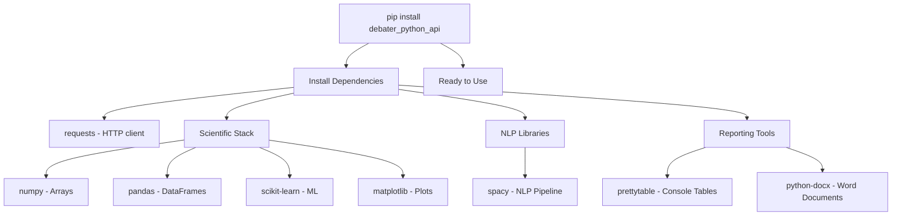

Sources: [pyproject.toml:18-28]()

## Basic Setup and Authentication

### Creating the API Client

The primary entry point is the `DebaterApi` factory class, which provides access to all available service clients.

```python
from debater_python_api.api.debater_api import DebaterApi

# Initialize with your API key
debater_api = DebaterApi('YOUR_API_KEY_HERE')
```

### Authentication

All API calls require a valid API key. Replace `'YOUR_API_KEY_HERE'` with your actual API key from IBM's Debater Early Access Program.

**Client Architecture Overview**

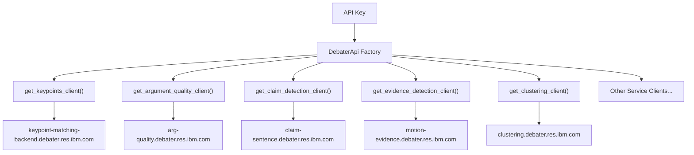

Sources: [debater_python_api/examples/keypoints_example.py:4-5](), [debater_python_api/integration_tests/api/clients/ServicesIT.py:26]()

## Quick Start Example

### Key Point Analysis (Primary Feature)

The most commonly used feature is Key Point Analysis, which identifies and matches key points in collections of text comments.

```python
from debater_python_api.api.clients.key_point_analysis.KpAnalysisUtils import KpAnalysisUtils
from debater_python_api.api.debater_api import DebaterApi

# Initialize API client
debater_api = DebaterApi('YOUR_API_KEY_HERE')
keypoints_client = debater_api.get_keypoints_client()

# Sample comments about cannabis
comments_texts = [
    'Cannabis has detrimental effects on cognition and memory, some of which are irreversible.',
    'Cannabis can severely impact memory and productivity in its consumers.',
    'Cannabis harms the memory and learning capabilities of its consumers.',
    'Frequent use can impair cognitive ability.',
    'Cannabis harms memory, which in the long term hurts progress and can hurt people',
    'Frequent marijuana use can seriously affect short-term memory.',
    'Marijuana is very addictive, and therefore very dangerous',
    'Cannabis is addictive and very dangerous for use.',
    'Cannabis can be very harmful and addictive, especially for young people',
    'Cannabis is very addictive.'
]

# Initialize logging for progress tracking
KpAnalysisUtils.init_logger()

# Run key point analysis
keypoint_matchings = keypoints_client.run(comments_texts)

# Print results with top 10 sentences per key point
KpAnalysisUtils.print_result(keypoint_matchings, n_sentences_per_kp=10, title="KPA Example")
```

**Key Point Analysis Flow**

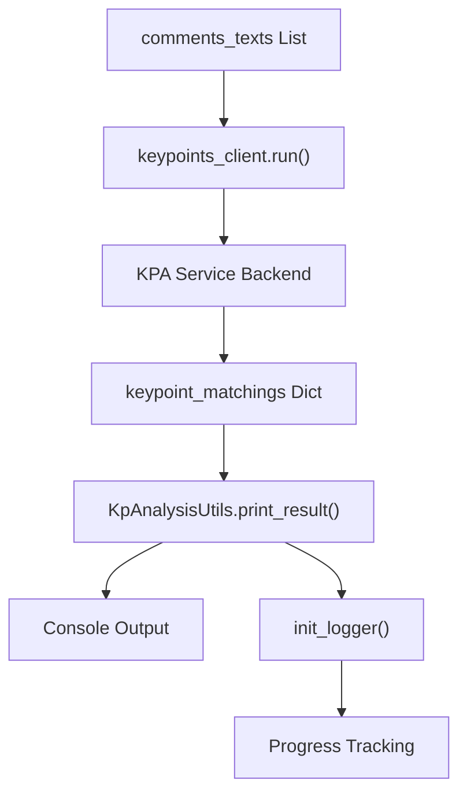

Sources: [debater_python_api/examples/keypoints_example.py:1-23]()

## Available Services Overview

The SDK provides access to multiple NLP services through specialized client classes:

| Service | Client Method | Purpose |
|---------|---------------|---------|
| Key Point Analysis | `get_keypoints_client()` | Identify and match key points in text collections |
| Argument Quality | `get_argument_quality_client()` | Score argument quality for sentence-topic pairs |
| Claim Detection | `get_claim_detection_client()` | Detect claims in text relative to topics |
| Evidence Detection | `get_evidence_detection_client()` | Identify evidence in text for topics |
| Clustering | `get_clustering_client()` | Group similar sentences into clusters |
| Claim Boundaries | `get_claim_boundaries_client()` | Identify claim boundaries within sentences |
| Pro/Con Analysis | `get_pro_con_client()` | Determine pro/con stance relative to topics |
| Term Relations | `get_term_relater_client()` | Measure semantic relatedness between terms |

### Service Usage Pattern

All service clients follow a consistent usage pattern:

```python
# Get specific client
service_client = debater_api.get_[service_name]_client()

# Prepare input data (varies by service)
input_data = [{'sentence': 'text', 'topic': 'topic'}]  # Common format

# Run analysis
results = service_client.run(input_data)

# Process results (format varies by service)
```

**Service Client Pattern**

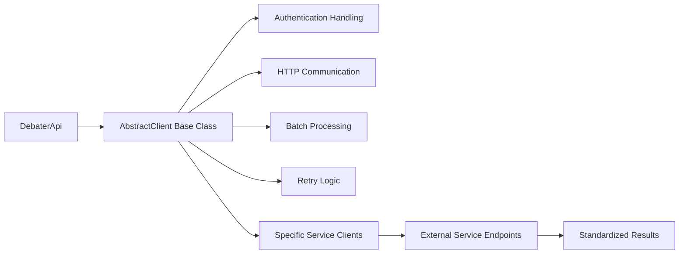

Sources: [debater_python_api/integration_tests/api/clients/ServicesIT.py:28-173]()

## Error Handling and Logging

### Logging Setup

Many services provide logging capabilities to track progress and debug issues:

```python
from debater_python_api.api.clients.key_point_analysis.KpAnalysisUtils import KpAnalysisUtils

# Initialize logging for Key Point Analysis
KpAnalysisUtils.init_logger()
```

### Common Error Scenarios

- **Authentication errors**: Invalid or missing API keys
- **Service unavailability**: Network issues or service maintenance
- **Input validation**: Malformed data or unsupported formats
- **Rate limiting**: Exceeding API usage limits

Sources: [debater_python_api/examples/keypoints_example.py:20](), [debater_python_api/integration_tests/api/clients/ServicesIT.py:204]()

## Next Steps

### For Key Point Analysis
- See [KPA Client Usage](#3.1) for detailed client operations
- See [Data Processing and Results](#3.2) for working with analysis results
- See [Reporting and Visualization](#3.3) for generating reports and visualizations

### For Other Services
- See [Argument Quality Client](#4.1) for scoring argument quality
- See [Claim and Evidence Detection](#4.2) for claim and evidence analysis
- See [Text Analysis Clients](#4.3) for clustering and other NLP services

### For Advanced Usage
- See [SDK Architecture](#5.1) for understanding internal design
- See [Error Handling](#5.2) for comprehensive error management
- See [Utilities and Helpers](#5.3) for data processing utilities

Sources: [debater_python_api/examples/keypoints_example.py:1-23](), [debater_python_api/integration_tests/api/clients/ServicesIT.py:19-254](), [pyproject.toml:7-29]()16:T2bc4,# Key Point Analysis

<details>
<summary>Relevant source files</summary>

The following files were used as context for generating this wiki page:

- [debater_python_api/api/clients/key_point_analysis/KpAnalysisUtils.py](debater_python_api/api/clients/key_point_analysis/KpAnalysisUtils.py)
- [debater_python_api/api/clients/keypoints_client.py](debater_python_api/api/clients/keypoints_client.py)

</details>


The Key Point Analysis (KPA) system is the primary feature of the Debater Python SDK, providing automated extraction and analysis of key points from textual comments. This system identifies recurring themes and arguments in large collections of text, matches sentences to key points, and generates comprehensive reports and visualizations.

For information about other NLP services in the SDK, see [Other NLP Services](#4). For administrative operations and user management, see [Administrative Operations](#3.4).

## System Overview

The Key Point Analysis system operates through a multi-stage pipeline that processes textual comments, extracts key points, matches sentences to these key points, and generates various output formats including reports, visualizations, and hierarchical summaries.

### Core Architecture

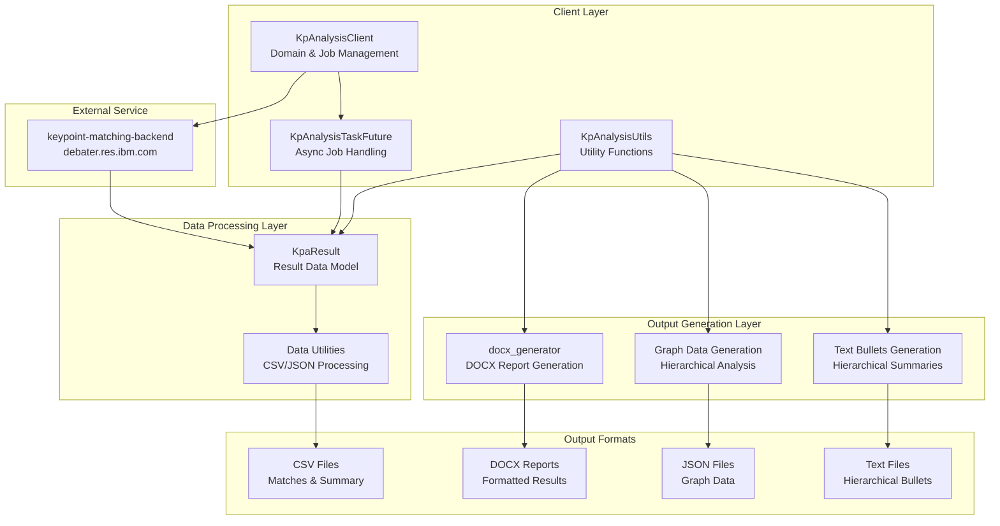

Sources: [debater_python_api/api/clients/keypoints_client.py:23-344](), [debater_python_api/api/clients/key_point_analysis/KpAnalysisUtils.py:13-512]()

### Key Point Analysis Workflow

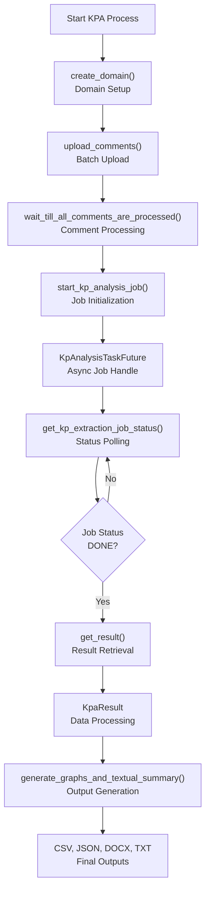

Sources: [debater_python_api/api/clients/keypoints_client.py:88-263](), [debater_python_api/api/clients/keypoints_client.py:345-412]()

## Core Components

### KpAnalysisClient

The `KpAnalysisClient` class serves as the primary interface for interacting with the Key Point Analysis service. It provides methods for domain management, comment upload, job execution, and result retrieval.

| Method | Purpose | Key Parameters |
|--------|---------|----------------|
| `create_domain()` | Creates analysis domains with custom parameters | `domain`, `domain_params` |
| `upload_comments()` | Uploads comments for analysis in batches | `domain`, `comments_ids`, `comments_texts` |
| `start_kp_analysis_job()` | Initiates KPA job asynchronously | `domain`, `run_params`, `comments_ids` |
| `get_kp_extraction_job_status()` | Polls job status and retrieves results | `job_id`, `top_k_kps` |
| `run()` | Simplified end-to-end analysis for small datasets | `comments_texts`, `comments_ids` |

**Domain Parameters:**
- `dont_split`: Prevents automatic sentence splitting
- `do_stance_analysis`: Enables stance detection (positive/negative/neutral)
- `do_kp_quality`: Calculates keypoint quality scores

**Run Parameters:**
- `keypoints`: Predefined keypoints for matching
- `arg_min_len`/`arg_max_len`: Sentence length filtering
- `mapping_policy`: Matching strictness (STRICT/NORMAL/LOOSE)
- `n_top_kps`: Number of keypoints to generate

Sources: [debater_python_api/api/clients/keypoints_client.py:23-344]()

### KpAnalysisTaskFuture

The `KpAnalysisTaskFuture` class handles asynchronous job execution, providing polling capabilities and result retrieval for long-running KPA jobs.

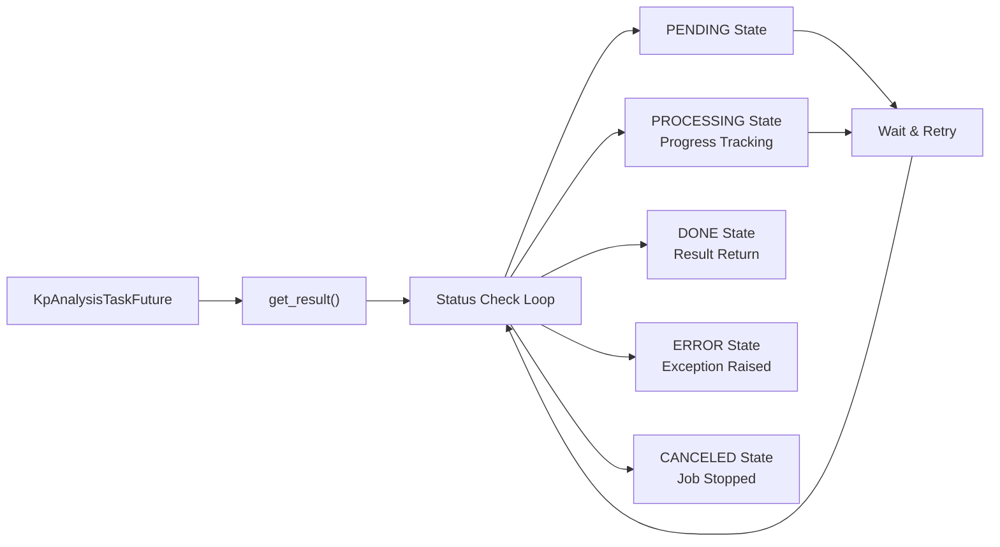

Sources: [debater_python_api/api/clients/keypoints_client.py:345-428]()

### KpAnalysisUtils

The `KpAnalysisUtils` class provides static utility methods for result processing, report generation, and data transformation.

**Key Utility Functions:**

| Method | Purpose | Output |
|--------|---------|---------|
| `write_result_to_csv()` | Exports results to CSV format | Matches and summary files |
| `create_graph_data()` | Generates graph data for visualization | JSON graph structure |
| `generate_graphs_and_textual_summary()` | Creates comprehensive output package | Multiple file formats |
| `hierarchical_graph_data_to_textual_bullets()` | Converts graph to hierarchical text | Bullet-point summaries |

**Graph Data Generation Process:**
1. Extract keypoint-to-sentence mappings
2. Calculate inter-keypoint relationships
3. Create nodes (keypoints) and edges (relationships)
4. Generate hierarchical structure
5. Filter based on relationship thresholds

Sources: [debater_python_api/api/clients/key_point_analysis/KpAnalysisUtils.py:52-512]()

## Data Processing Pipeline

### Result Processing Flow

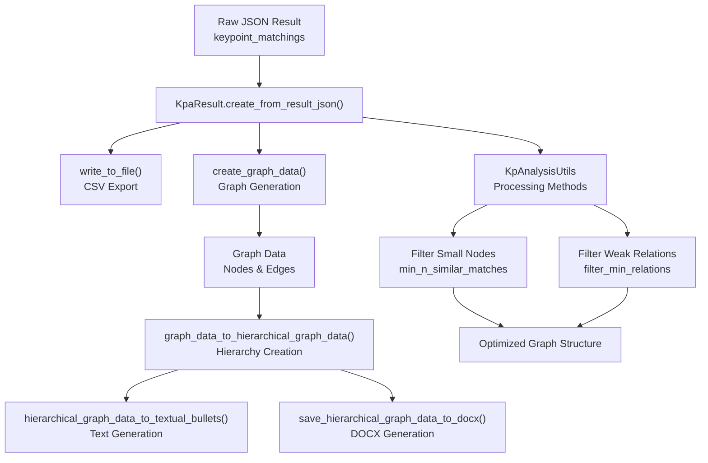

Sources: [debater_python_api/api/clients/key_point_analysis/KpAnalysisUtils.py:137-210](), [debater_python_api/api/clients/key_point_analysis/KpAnalysisUtils.py:313-377]()

### Output Generation Methods

The system generates multiple output formats to support different analysis needs:

**CSV Files:**
- `*_result.csv`: Complete sentence-to-keypoint matches
- `*_kps_summary.csv`: Aggregated keypoint statistics
- `*_hierarchy.csv`: Hierarchical relationship data

**JSON Files:**
- `*_graph_data.json`: Full graph structure for visualization
- `*_hierarchical_graph_data.json`: Simplified hierarchical graph

**Document Files:**
- `*_hierarchical.docx`: Formatted Microsoft Word report
- `*_hierarchical_bullets.txt`: Plain text hierarchical summary

**Graph Data Structure:**
```json
{
  "type": "node",
  "data": {
    "id": "node_id",
    "kp": "keypoint_text",
    "n_matches": "match_count",
    "relative_val": "normalized_score",
    "matches": [{"sentence_text": "...", "match_score": 0.85}]
  }
}
```

Sources: [debater_python_api/api/clients/key_point_analysis/KpAnalysisUtils.py:144-209](), [debater_python_api/api/clients/key_point_analysis/KpAnalysisUtils.py:313-377]()

## Advanced Features

### Hierarchical Analysis

The system creates hierarchical relationships between keypoints by analyzing sentence overlap and semantic similarity:

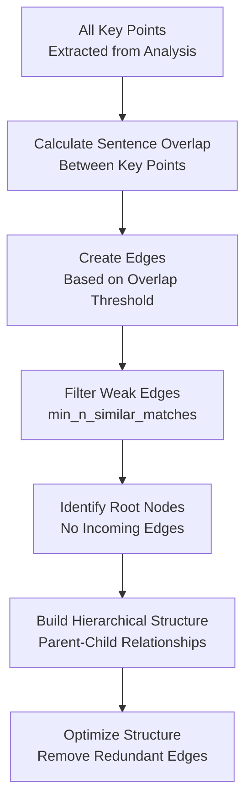

**Edge Calculation:**
- Edges represent relationships between keypoints
- Edge weight = `n_sentences_i_in_j / len(sents_i)`
- Minimum overlap threshold filters weak relationships
- Hierarchical structure keeps only strongest parent relationships

Sources: [debater_python_api/api/clients/key_point_analysis/KpAnalysisUtils.py:191-209](), [debater_python_api/api/clients/key_point_analysis/KpAnalysisUtils.py:247-256]()

### Batch Processing and Caching

The system implements efficient batch processing and caching mechanisms:

**Batch Upload:**
- Comments uploaded in configurable batch sizes (default: 2000)
- Progress tracking for large datasets
- Automatic retry logic for failed uploads

**Caching Strategy:**
- Domain-level caching for incremental analysis
- Delta calculation for new jobs in existing domains
- `use_cache` parameter controls cache behavior

**Comment Processing:**
- Automatic text cleaning and sentence splitting
- Quality score calculation for argument filtering
- Stance analysis when enabled in domain parameters

Sources: [debater_python_api/api/clients/keypoints_client.py:109-143](), [debater_python_api/api/clients/keypoints_client.py:168-211]()17:T3823,# KPA Client Usage

<details>
<summary>Relevant source files</summary>

The following files were used as context for generating this wiki page:

- [debater_python_api/api/clients/keypoints_client.py](debater_python_api/api/clients/keypoints_client.py)
- [debater_python_api/examples/keypoints_example.py](debater_python_api/examples/keypoints_example.py)
- [debater_python_api/integration_tests/api/clients/ServicesIT.py](debater_python_api/integration_tests/api/clients/ServicesIT.py)

</details>


This document provides a detailed guide for using the `KpAnalysisClient` to perform Key Point Analysis operations. It covers client initialization, domain management, comment upload, job submission, and result retrieval through the primary client interface.

For information about processing and analyzing KPA results, see [Data Processing and Results](#3.2). For generating reports and visualizations from results, see [Reporting and Visualization](#3.3). For administrative operations and system management, see [Administrative Operations](#3.4).

## Client Initialization

The `KpAnalysisClient` is the primary interface for Key Point Analysis operations. It extends `AbstractClient` and provides methods for managing domains, uploading comments, and executing KPA jobs.

```python
from debater_python_api.api.debater_api import DebaterApi

# Initialize through the factory
debater_api = DebaterApi('YOUR_API_KEY')
kpa_client = debater_api.get_keypoints_client()

# Or initialize directly
from debater_python_api.api.clients.keypoints_client import KpAnalysisClient
kpa_client = KpAnalysisClient('YOUR_API_KEY')
```

### Client Configuration

| Parameter | Type | Default | Description |
|-----------|------|---------|-------------|
| `apikey` | str | Required | User's API key from the early access program |
| `host` | str | `https://keypoint-matching-backend.debater.res.ibm.com` | Service endpoint URL |
| `verify_certificate` | bool | `True` | SSL certificate verification |

Sources: [debater_python_api/api/clients/keypoints_client.py:27-36]()

## KPA Client Architecture

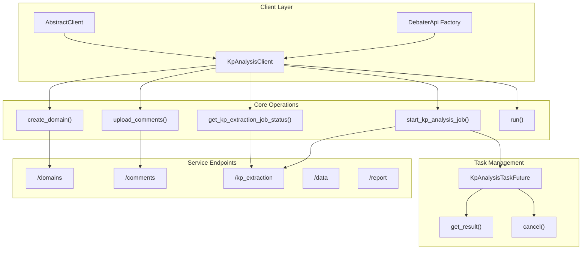

Sources: [debater_python_api/api/clients/keypoints_client.py:23-36](), [debater_python_api/api/clients/keypoints_client.py:345-359]()

## Domain Management

Domains are workspaces for organizing comments and KPA jobs. Each domain can be configured with specific processing parameters.

### Creating Domains

```python
# Create domain with default parameters
kpa_client.create_domain('my_domain')

# Create domain with custom parameters
domain_params = {
    'dont_split': True,          # Keep comments as-is without sentence splitting
    'do_stance_analysis': True,  # Calculate stance for sentences
    'do_kp_quality': True        # Calculate keypoint quality scores
}
kpa_client.create_domain('my_domain', domain_params)
```

### Domain Parameters

| Parameter | Type | Default | Description |
|-----------|------|---------|-------------|
| `dont_split` | bool | `False` | Skip comment cleaning and sentence splitting |
| `do_stance_analysis` | bool | `False` | Calculate stance (positive/negative/neutral/suggestion) |
| `do_kp_quality` | bool | `False` | Calculate keypoint quality scores |

### Domain Cleanup

```python
# Delete specific domain
kpa_client.delete_domain_cannot_be_undone('my_domain')

# Delete all domains
kpa_client.delete_all_domains_cannot_be_undone()
```

Sources: [debater_python_api/api/clients/keypoints_client.py:88-107](), [debater_python_api/api/clients/keypoints_client.py:290-306]()

## Comment Upload and Processing

Comments must be uploaded to domains before running KPA jobs. The system processes comments by cleaning text and splitting into sentences.

### Upload Process

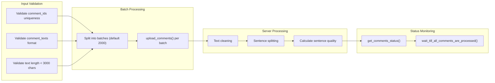

### Upload Comments

```python
# Upload comments to domain
comments_ids = ['1', '2', '3']
comments_texts = [
    'Cannabis has detrimental effects on cognition',
    'Cannabis can severely impact memory',
    'Cannabis harms learning capabilities'
]

kpa_client.upload_comments('my_domain', comments_ids, comments_texts)

# Monitor processing status
status = kpa_client.get_comments_status('my_domain')
print(f"Processed: {status['processed_comments']}")
print(f"Pending: {status['pending_comments']}")
print(f"Sentences: {status['processed_sentences']}")

# Wait for all comments to be processed
kpa_client.wait_till_all_comments_are_processed('my_domain')
```

### Comment Upload Constraints

| Constraint | Value | Description |
|------------|-------|-------------|
| Max comment length | 3000 characters | Individual comment text limit |
| Batch size | 2000 (default) | Comments per API call |
| Comment ID uniqueness | Required | No duplicate IDs within domain |
| Empty comments | Not allowed | Comments must contain non-whitespace text |

Sources: [debater_python_api/api/clients/keypoints_client.py:109-143](), [debater_python_api/api/clients/keypoints_client.py:144-166]()

## Job Submission and Execution

KPA jobs extract key points from comments and match sentences to those key points. Jobs run asynchronously and return a `KpAnalysisTaskFuture` for result retrieval.

### Job Parameters

The `run_params` dictionary controls job behavior:

| Parameter | Type | Default | Description |
|-----------|------|---------|-------------|
| `keypoints` | List[str] | `[]` | Predefined key points for matching |
| `keypoints_by_job_id` | str | `None` | Use key points from previous job |
| `arg_min_len` | int | `4` | Minimum sentence length (tokens) |
| `arg_max_len` | int | `36` | Maximum sentence length (tokens) |
| `arg_relative_aq_threshold` | float | `1.0` | Argument quality percentile threshold |
| `mapping_policy` | str | `"NORMAL"` | Matching policy: "STRICT", "NORMAL", "LOOSE" |
| `sentence_to_multiple_kps` | bool | `False` | Allow sentence matching to multiple key points |
| `n_top_kps` | int | Auto | Number of key points to generate |
| `kp_relative_aq_threshold` | float | `0.65` | Key point quality percentile threshold |
| `invalid_kps_comment_ids` | List[str] | `[]` | Exclude comments from key point candidates |

### Starting Jobs

```python
# Start job with default parameters
future = kpa_client.start_kp_analysis_job('my_domain')

# Start job with custom parameters
run_params = {
    'arg_min_len': 5,
    'arg_max_len': 40,
    'mapping_policy': 'STRICT',
    'n_top_kps': 10
}

future = kpa_client.start_kp_analysis_job(
    domain='my_domain',
    run_params=run_params,
    description='Custom parameter analysis'
)

# Start job with predefined key points
run_params = {
    'keypoints': [
        'Cannabis affects memory and cognition',
        'Cannabis can be addictive',
        'Cannabis has medical benefits'
    ]
}

future = kpa_client.start_kp_analysis_job('my_domain', run_params=run_params)
```

Sources: [debater_python_api/api/clients/keypoints_client.py:168-211]()

## Result Retrieval

The `KpAnalysisTaskFuture` class provides methods for retrieving job results asynchronously.

### Job Status Flow

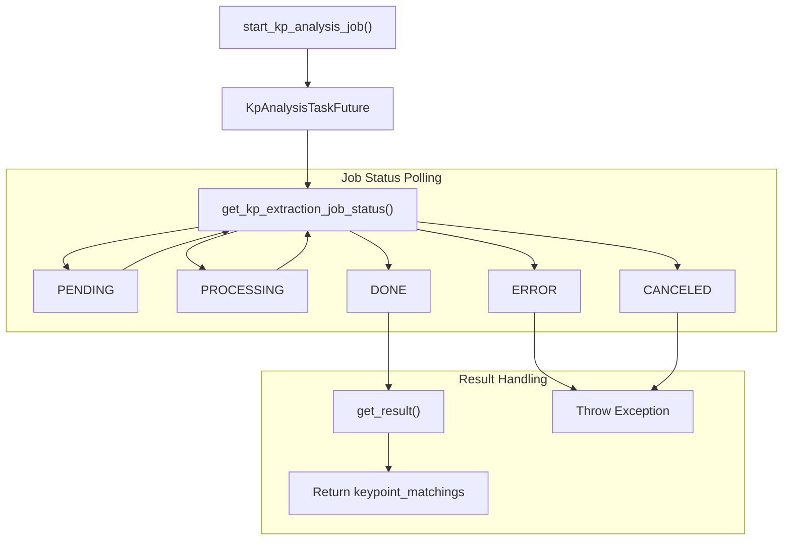

### Retrieving Results

```python
# Get result (blocks until completion)
result = future.get_result()

# Get result with limited key points and sentences
result = future.get_result(
    top_k_kps=5,
    top_k_sentences_per_kp=10
)

# Non-blocking check
result = future.get_result(dont_wait=True)
if result is None:
    print("Job still running")

# Get result with timeout
result = future.get_result(wait_secs=300)  # 5 minutes max

# Cancel running job
future.cancel()
```

### Result Structure

The result contains a `keypoint_matchings` list with the following structure:

```python
{
    'keypoint_matchings': [
        {
            'keypoint': 'Cannabis affects memory and cognition',
            'matching': [
                {
                    'domain': 'my_domain',
                    'comment_id': '1',
                    'sentence_id': '1_0',
                    'sentence_text': 'Cannabis has detrimental effects on cognition',
                    'score': 0.95,
                    'argument_quality': 0.87,
                    'num_tokens': 7,
                    'span_start': 0,
                    'span_end': 45
                }
            ]
        }
    ]
}
```

Sources: [debater_python_api/api/clients/keypoints_client.py:367-412](), [debater_python_api/api/clients/keypoints_client.py:213-237]()

## Simple Usage Pattern

For straightforward use cases, the `run` method provides a simplified interface that handles the entire workflow.

```python
# Simple usage - handles everything automatically
comments_texts = [
    'Cannabis has detrimental effects on cognition',
    'Cannabis can severely impact memory',
    'Cannabis harms learning capabilities'
]

result = kpa_client.run(comments_texts)

# With custom comment IDs
comments_ids = ['comment_1', 'comment_2', 'comment_3']
result = kpa_client.run(comments_texts, comments_ids)
```

### Simple Usage Workflow

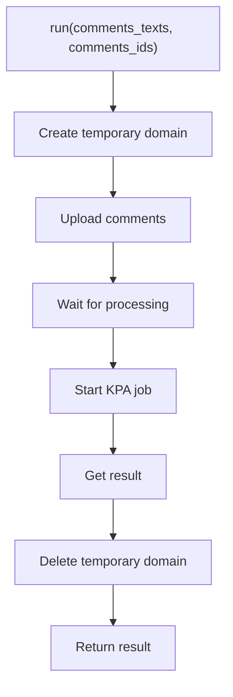

**Limitations**: The `run` method is limited to 10,000 comments maximum.

Sources: [debater_python_api/api/clients/keypoints_client.py:239-263](), [debater_python_api/examples/keypoints_example.py:1-23]()

## Error Handling and Monitoring

The client provides several methods for monitoring system status and handling errors.

### Exception Types

| Exception | HTTP Status | Description |
|-----------|-------------|-------------|
| `KpaIllegalInputException` | 422 | Invalid request parameters |
| `KpaNoPrivilegesException` | 403 | Insufficient user privileges |
| `ConnectionError` | N/A | Network connectivity issues |

### Monitoring Methods

```python
# Check service health
status = kpa_client.run_self_check()
print(f"Service status: {status['status']}")  # UP or DOWN

# Get user report
report = kpa_client.get_full_report(days_ago=30)
print(f"Domains: {report['comments_status']}")
print(f"Jobs: {report['kp_analysis_status']}")

# Check comment limits
limits = kpa_client.get_comments_limit()
print(f"Comment limit: {limits['n_comments_limit']}")

# Get domain sentences
sentences = kpa_client.get_sentences_for_domain('my_domain')
```

### Job Management

```python
# Cancel specific job
kpa_client.cancel_kp_extraction_job('job_id')

# Cancel all jobs in domain
kpa_client.cancel_all_extraction_jobs_for_domain('my_domain')

# Cancel all jobs across all domains
kpa_client.cancel_all_extraction_jobs_all_domains()
```

Sources: [debater_python_api/api/clients/keypoints_client.py:326-342](), [debater_python_api/api/clients/keypoints_client.py:308-325](), [debater_python_api/api/clients/keypoints_client.py:265-288]()18:T285c,# Data Processing and Results

<details>
<summary>Relevant source files</summary>

The following files were used as context for generating this wiki page:

- [debater_python_api/api/clients/key_point_analysis/KpaResult.py](debater_python_api/api/clients/key_point_analysis/KpaResult.py)
- [debater_python_api/api/clients/key_point_analysis/utils.py](debater_python_api/api/clients/key_point_analysis/utils.py)

</details>


This page covers the data processing components and result handling capabilities of the Key Point Analysis system. It focuses on the `KpaResult` class and associated utilities that transform raw API responses into structured data formats suitable for analysis, export, and visualization.

For information about generating reports and visualizations from these results, see [Reporting and Visualization](#3.3). For details on the KPA client that produces these results, see [KPA Client Usage](#3.1).

## Overview

The Key Point Analysis system processes raw JSON responses from the API into structured data formats through the `KpaResult` class. This class serves as the central data model for handling analysis results, providing multiple DataFrame representations and export capabilities.

## KpaResult Data Model

The `KpaResult` class contains four primary data structures that represent different views of the analysis results:

| Component | Type | Purpose |
|-----------|------|---------|
| `result_json` | dict | Raw JSON response from the API |
| `result_df` | DataFrame | Detailed match-level results |
| `summary_df` | DataFrame | Key point summary statistics |
| `hierarchy_df` | DataFrame | Hierarchical relationship data |

**KpaResult Data Flow**
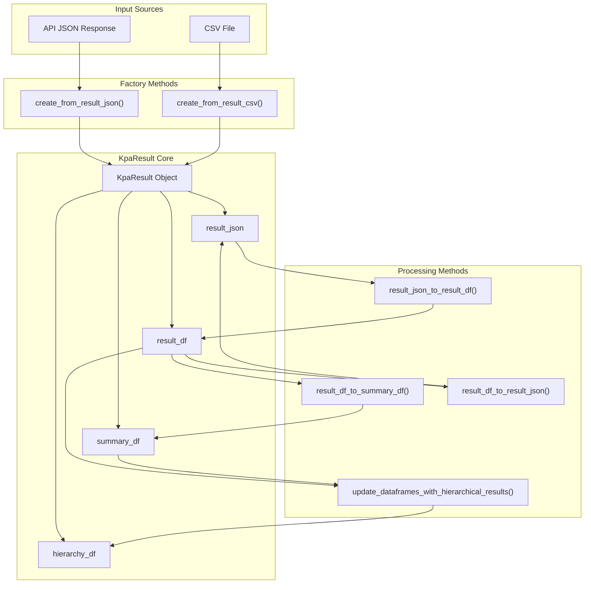

Sources: [debater_python_api/api/clients/key_point_analysis/KpaResult.py:13-19]()

## Data Transformation Pipeline

The system transforms raw API responses through a multi-stage pipeline that creates different analytical views of the data.

**Data Processing Pipeline**
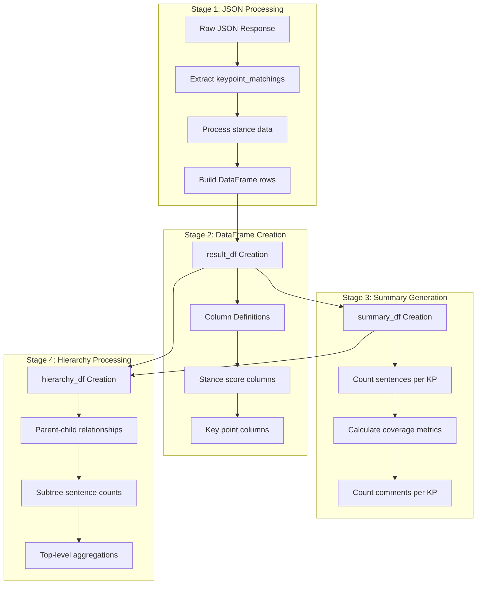

Sources: [debater_python_api/api/clients/key_point_analysis/KpaResult.py:22-61](), [debater_python_api/api/clients/key_point_analysis/KpaResult.py:64-114](), [debater_python_api/api/clients/key_point_analysis/KpaResult.py:117-141]()

### Result DataFrame Structure

The `result_df` contains detailed match-level information with the following core columns:

| Column | Description |
|--------|-------------|
| `kp` | Key point text |
| `sentence_text` | Matched sentence text |
| `match_score` | Match confidence score |
| `comment_id` | Source comment identifier |
| `sentence_id` | Sentence identifier within comment |
| `argument_quality` | Argument quality score |
| `kp_quality` | Key point quality score |

Additional columns are dynamically added based on the analysis configuration:
- Stance score columns (when stance analysis is enabled)
- `selected_stance` and `stance_conf` for the highest-confidence stance
- `kp_stance` for key point stance assignment

Sources: [debater_python_api/api/clients/key_point_analysis/KpaResult.py:55-61]()

### Summary DataFrame Structure

The `summary_df` provides aggregated statistics for each key point:

| Column | Description |
|--------|-------------|
| `kp` | Key point text |
| `#sentences` | Number of matched sentences |
| `sentences_coverage` | Percentage of total sentences |
| `#comments` | Number of comments containing matches |
| `comments_coverage` | Percentage of total comments |
| `num_tokens` | Token count for the key point |
| `argument_quality` | Argument quality score |
| `kp_quality` | Key point quality score |

Sources: [debater_python_api/api/clients/key_point_analysis/KpaResult.py:110-114]()

## Working with Results

### Creating KpaResult Objects

The system provides two factory methods for creating `KpaResult` objects:

```python
# From API JSON response
result = KpaResult.create_from_result_json(json_response, name="analysis_1")

# From CSV file
result = KpaResult.create_from_result_csv("results.csv", name="analysis_1")
```

Sources: [debater_python_api/api/clients/key_point_analysis/KpaResult.py:185-193](), [debater_python_api/api/clients/key_point_analysis/KpaResult.py:195-201]()

### Data Access and Analysis

The `KpaResult` object provides methods for accessing and analyzing the processed data:

```python
# Get sentence counts
total_sentences = result.get_number_of_unique_sentences(include_unmatched=True)
matched_sentences = result.get_number_of_unique_sentences(include_unmatched=False)

# Get key point statistics
kp_stats = result.get_kp_to_n_matched_sentences(include_none=False)
```

Sources: [debater_python_api/api/clients/key_point_analysis/KpaResult.py:297-318]()

### Console Output

The `print_result` method provides formatted console output with hierarchical display:

```python
result.print_result(n_sentences_per_kp=5, title="Analysis Results")
```

This method handles hierarchical key point relationships and displays coverage statistics.

Sources: [debater_python_api/api/clients/key_point_analysis/KpaResult.py:218-292]()

## Export and Comparison Features

### File Export

The system supports exporting results to CSV files in multiple formats:

```python
# Export all DataFrames
result.write_to_file("analysis_results.csv", also_hierarchy=True)
```

This creates three files:
- `analysis_results.csv` - Detailed match results
- `analysis_results_kps_summary.csv` - Key point summary
- `analysis_results_kps_hierarchy.csv` - Hierarchical relationships

Sources: [debater_python_api/api/clients/key_point_analysis/KpaResult.py:203-216]()

### Result Comparison

The `compare_with_other` method enables comparison between different analysis results:

```python
comparison_df = result1.compare_with_other(result2)
```

The comparison DataFrame includes:
- Key points present in both results
- Sentence counts and percentages for each result
- Change metrics between results
- Key points unique to each result

Sources: [debater_python_api/api/clients/key_point_analysis/KpaResult.py:320-356]()

## Utility Functions

The system includes utility functions for data processing operations:

**Data Processing Utilities**
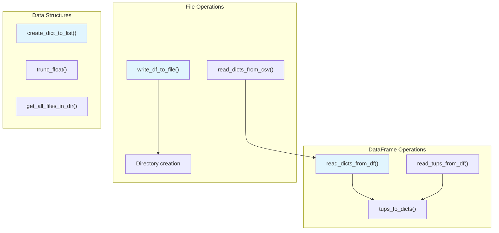

Sources: [debater_python_api/api/clients/key_point_analysis/utils.py:9-65]()

### Key Utility Functions

| Function | Purpose |
|----------|---------|
| `read_dicts_from_df()` | Convert DataFrame to list of dictionaries |
| `create_dict_to_list()` | Group list of tuples into dictionary |
| `write_df_to_file()` | Export DataFrame to CSV with directory creation |
| `trunc_float()` | Truncate floating-point numbers to specified precision |

Sources: [debater_python_api/api/clients/key_point_analysis/utils.py:35-37](), [debater_python_api/api/clients/key_point_analysis/utils.py:9-13](), [debater_python_api/api/clients/key_point_analysis/utils.py:58-64](), [debater_python_api/api/clients/key_point_analysis/utils.py:43-51]()19:T2c61,# Reporting and Visualization

<details>
<summary>Relevant source files</summary>

The following files were used as context for generating this wiki page:

- [debater_python_api/api/clients/key_point_analysis/KpAnalysisUtils.py](debater_python_api/api/clients/key_point_analysis/KpAnalysisUtils.py)
- [debater_python_api/api/clients/key_point_analysis/docx_generator.py](debater_python_api/api/clients/key_point_analysis/docx_generator.py)

</details>


This page covers the reporting and visualization capabilities of the Key Point Analysis system, including console output, file generation, graph creation, and document formatting. The system provides multiple output formats from KPA results including CSV files, JSON graph data, hierarchical text representations, and formatted DOCX reports.

For information about processing KPA results and the `KpaResult` data model, see [Data Processing and Results](#3.2). For general SDK utilities beyond KPA-specific reporting, see [Utilities and Helpers](#5.3).

## Console Output and Reporting

The `KpAnalysisUtils` class provides methods for displaying KPA results and reports directly to the console with formatted output and logging.

### User Report Display

The `print_report()` method displays comprehensive user account information including domain status and job history:

```python
KpAnalysisUtils.print_report(user_report)
```

This outputs structured information about domain statuses, data processing status, and key point analysis job history with detailed logging.

### Result Console Output

The `print_result()` method provides formatted console display of KPA results:

```python
KpAnalysisUtils.print_result(result_json, n_sentences_per_kp=5, title="Analysis Results")
```

This leverages the `KpaResult` class to display key points with their matching sentences in a readable console format.

**Sources:** [debater_python_api/api/clients/key_point_analysis/KpAnalysisUtils.py:18-37](), [debater_python_api/api/clients/key_point_analysis/KpAnalysisUtils.py:75-77]()

## CSV File Generation

The system generates multiple CSV output formats from KPA results, providing both detailed match data and summary statistics.

### Primary CSV Output

The `write_result_to_csv()` method creates two main CSV files:

```python
KpAnalysisUtils.write_result_to_csv(result_json, result_file, also_hierarchy=True)
```

This generates:
- **Matches file**: Complete sentence-to-key point matching data
- **Summary file**: Aggregated key point statistics with suffix `_kps_summary.csv`
- **Hierarchy file**: Hierarchical relationships when `also_hierarchy=True`

### Sentence Data Export

The `write_sentences_to_csv()` method exports sentence-level data with stance information:

```python
KpAnalysisUtils.write_sentences_to_csv(sentences, out_file)
```

This processes stance dictionaries to determine the highest confidence stance for each sentence and exports the data with stance confidence scores.

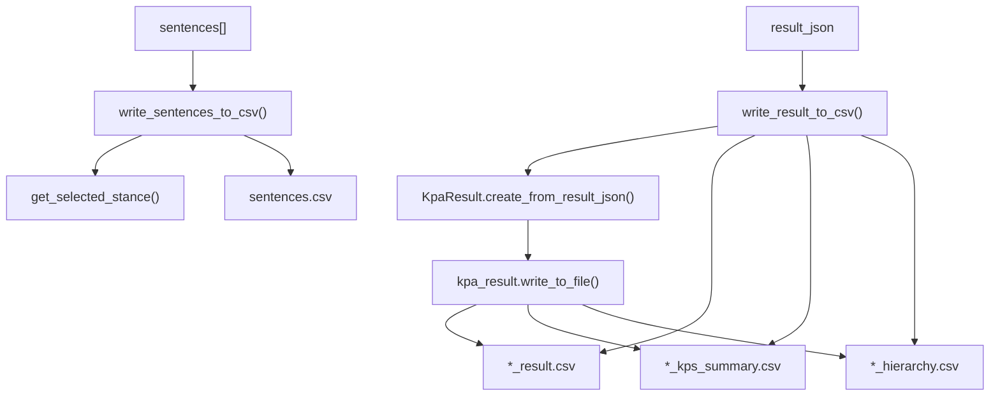

**CSV Output Pipeline**

**Sources:** [debater_python_api/api/clients/key_point_analysis/KpAnalysisUtils.py:52-66](), [debater_python_api/api/clients/key_point_analysis/KpAnalysisUtils.py:80-99]()

## Graph Data and Visualization

The system creates interactive graph representations of key point relationships that can be used with visualization tools.

### Graph Data Creation

The `create_graph_data()` method transforms KPA results into graph format:

```python
graph_data = KpAnalysisUtils.create_graph_data(
    kpa_result, 
    min_n_similar_matches=5, 
    n_matches_samples=20
)
```

This creates nodes representing key points and edges representing relationships based on shared matching sentences. The algorithm:
1. Creates nodes for each key point with match statistics
2. Calculates edge weights based on sentence overlap between key points
3. Includes sample matching sentences for each key point

### Hierarchical Graph Generation

The `graph_data_to_hierarchical_graph_data()` method simplifies graphs into hierarchical structures:

```python
hierarchical_data = KpAnalysisUtils.graph_data_to_hierarchical_graph_data(
    graph_data=graph_data,
    filter_small_nodes=0.1,
    filter_min_relations=0.4,
    filter_big_to_small_edges=True
)
```

This applies filtering to create cleaner hierarchical representations by removing small nodes, weak relationships, and maintaining parent-child directionality.

```mermaid
graph TD
    KpaResult["KpaResult"] --> CreateGraph["create_graph_data()"]
    CreateGraph --> Nodes["Graph Nodes"]
    CreateGraph --> Edges["Graph Edges"]
    CreateGraph --> GraphData["graph_data.json"]
    
    GraphData --> HierarchicalFilter["graph_data_to_hierarchical_graph_data()"]
    HierarchicalFilter --> FilterNodes["filter_small_nodes"]
    HierarchicalFilter --> FilterEdges["filter_min_relations"]
    HierarchicalFilter --> FilterDirection["filter_big_to_small_edges"]
    
    FilterNodes --> HierarchicalData["hierarchical_graph_data.json"]
    FilterEdges --> HierarchicalData
    FilterDirection --> HierarchicalData
    
    HierarchicalData --> SaveGraph["save_graph_data()"]
    SaveGraph --> JSONFile["*.json output"]
```

**Graph Data Processing Pipeline**

**Sources:** [debater_python_api/api/clients/key_point_analysis/KpAnalysisUtils.py:137-209](), [debater_python_api/api/clients/key_point_analysis/KpAnalysisUtils.py:214-256]()

## Hierarchical Representations

The system provides multiple ways to represent key point hierarchies as text and structured data.

### Textual Bullet Format

The `hierarchical_graph_data_to_textual_bullets()` method creates indented bullet point representations:

```python
bullets = KpAnalysisUtils.hierarchical_graph_data_to_textual_bullets(
    graph_data=hierarchical_data,
    out_file="hierarchy_bullets.txt"
)
```

This generates hierarchical text with indentation levels representing parent-child relationships and match counts for each key point.

### Comprehensive Report Generation

The `generate_graphs_and_textual_summary()` method creates all visualization formats:

```python
KpAnalysisUtils.generate_graphs_and_textual_summary(
    result_file="results.csv",
    min_n_similar_matches_in_graph=5,
    n_top_matches_in_graph=20,
    filter_min_relations_for_text=0.4,
    n_top_matches_in_docx=50,
    include_match_score_in_docx=False,
    min_n_matches_in_docx=5,
    save_only_docx=False
)
```

This generates four output files:
- `*_graph_data.json`: Full graph data for visualization tools
- `*_hierarchical_graph_data.json`: Simplified hierarchical graph
- `*_hierarchical_bullets.txt`: Text bullet representation
- `*_hierarchical.docx`: Formatted DOCX report

**Sources:** [debater_python_api/api/clients/key_point_analysis/KpAnalysisUtils.py:267-310](), [debater_python_api/api/clients/key_point_analysis/KpAnalysisUtils.py:313-377]()

## DOCX Report Generation

The system creates comprehensive Microsoft Word documents with formatted reports, navigation, and hierarchical key point displays.

### Document Structure and Formatting

The `save_hierarchical_graph_data_to_docx()` function creates structured DOCX reports:

```python
save_hierarchical_graph_data_to_docx(
    kpa_result=kpa_result,
    graph_data=hierarchical_data,
    result_filename="results.csv",
    n_top_matches=50,
    sort_by_subtree=True,
    include_match_score=False,
    min_n_matches=5,
    file_suff=""
)
```

The generated document includes:
- **Data Statistics**: Overview of comments, sentences, and key points analyzed
- **Key Point Hierarchy**: Navigable hierarchical structure with internal links
- **Matching Sentences**: Detailed tables showing sentences matched to each key point
- **Navigation System**: Bookmarks and hyperlinks for easy document navigation

### Document Components

| Component | Description | Implementation |
|-----------|-------------|----------------|
| Data Statistics | Summary of analysis scope and coverage | `add_data_stats()` |
| Hierarchical Structure | Nested key point organization | `get_hierarchical_bullets()` |
| Matching Tables | Sentence-to-key point mappings | Table generation with `add_table()` |
| Navigation Links | Internal bookmarks and hyperlinks | `add_bookmark()`, `add_link()` |
| Formatting | Consistent styling and layout | Custom paragraph and heading styles |

```mermaid
graph TD
    KpaResult["KpaResult"] --> DocxGen["save_hierarchical_graph_data_to_docx()"]
    GraphData["graph_data"] --> DocxGen
    
    DocxGen --> CreateDoc["Document()"]
    DocxGen --> AddStats["add_data_stats()"]
    DocxGen --> CreateHierarchy["get_hierarchical_bullets()"]
    DocxGen --> CreateTables["Matching Tables"]
    
    CreateHierarchy --> AddBookmarks["add_bookmark()"]
    CreateTables --> AddLinks["add_link()"]
    
    AddStats --> FinalDoc["*.docx output"]
    AddBookmarks --> FinalDoc
    AddLinks --> FinalDoc
    CreateTables --> FinalDoc
    
    DocxGen --> Formatting["Document Formatting"]
    Formatting --> SetHeading["set_heading()"]
    Formatting --> InsertHR["insertHR()"]
    Formatting --> FinalDoc
```

**DOCX Generation Pipeline**

**Sources:** [debater_python_api/api/clients/key_point_analysis/docx_generator.py:121-297](), [debater_python_api/api/clients/key_point_analysis/docx_generator.py:94-119]()

## Output File Types and Formats

The KPA reporting system generates multiple complementary output formats, each serving different analysis and presentation needs.

### File Format Summary

| Format | Purpose | Key Features | Generated By |
|--------|---------|--------------|--------------|
| CSV | Data analysis and processing | Machine-readable, supports external tools | `write_result_to_csv()` |
| JSON | Graph visualization | Interactive graph data, web-compatible | `create_graph_data()` |
| TXT | Simple hierarchy viewing | Plain text bullets, easily shareable | `hierarchical_graph_data_to_textual_bullets()` |
| DOCX | Professional reporting | Formatted documents, navigation, tables | `save_hierarchical_graph_data_to_docx()` |

### Integrated Workflow

The `generate_graphs_and_textual_summary()` method provides a complete reporting workflow that creates all output formats from a single CSV input file. This method can be configured to generate only specific outputs using the `save_only_docx` parameter for focused report generation.

For working with existing hierarchical structures across different result sets, the `generate_graphs_and_textual_summary_for_given_tree()` method applies pre-calculated hierarchies to new data, enabling consistent reporting across related analyses.

**Sources:** [debater_python_api/api/clients/key_point_analysis/KpAnalysisUtils.py:313-377](), [debater_python_api/api/clients/key_point_analysis/KpAnalysisUtils.py:452-511]()1a:T237b,# Administrative Operations

<details>
<summary>Relevant source files</summary>

The following files were used as context for generating this wiki page:

- [debater_python_api/api/clients/keypoints_admin_client.py](debater_python_api/api/clients/keypoints_admin_client.py)

</details>


This document covers the administrative functionality provided by the `KpAnalysisAdminClient` class for managing users, domains, jobs, and system monitoring in the Key Point Analysis service. This client extends the standard KPA client with elevated permissions for system administration tasks.

For standard KPA client operations, see [KPA Client Usage](#3.1). For data processing and results handling, see [Data Processing and Results](#3.2).

## Admin Client Overview

The `KpAnalysisAdminClient` provides administrative control over the Key Point Analysis service through two main endpoint categories: reporting and actions. It requires special authentication credentials beyond the standard API key.

### Admin Client Architecture

```mermaid
graph TB
    subgraph "Client Hierarchy"
        KpAnalysisClient["KpAnalysisClient<br/>(Base Client)"]
        KpAnalysisAdminClient["KpAnalysisAdminClient<br/>(Admin Extension)"]
    end
    
    subgraph "Authentication"
        APIKey["apikey<br/>(Standard Auth)"]
        AdminPassword["admin_password<br/>(Admin Auth)"]
    end
    
    subgraph "Admin Endpoints"
        AdminReports["/admin_report<br/>(admin_reports_endpoint)"]
        AdminActions["/admin_action<br/>(admin_actions_endpoint)"]
    end
    
    subgraph "Report Types"
        DomainStatuses["domain_statuses"]
        JobStatuses["job_statuses_by_days<br/>job_statuses_by_dates<br/>not_finished_job_statuses"]
        CommentBatches["comment_batches_statuses"]
        CommentsStats["comments_stats"]
    end
    
    subgraph "Action Types"
        UserActions["delete_user<br/>delete_user_domain<br/>set_user_limit"]
        JobActions["cancel_job<br/>cancel_all_jobs<br/>cancel_all_jobs_by_user<br/>cancel_all_jobs_by_domain"]
        DomainActions["delete_old_domains"]
    end
    
    KpAnalysisClient --> KpAnalysisAdminClient
    APIKey --> KpAnalysisAdminClient
    AdminPassword --> KpAnalysisAdminClient
    
    KpAnalysisAdminClient --> AdminReports
    KpAnalysisAdminClient --> AdminActions
    
    AdminReports --> DomainStatuses
    AdminReports --> JobStatuses
    AdminReports --> CommentBatches
    AdminReports --> CommentsStats
    
    AdminActions --> UserActions
    AdminActions --> JobActions
    AdminActions --> DomainActions
```

**Sources:** [debater_python_api/api/clients/keypoints_admin_client.py:1-133]()

## Authentication and Setup

The admin client requires both a standard API key and an admin password for elevated operations.

### Initialization

| Parameter | Type | Description |
|-----------|------|-------------|
| `admin_password` | `str` | Administrative password for elevated operations |
| `apikey` | `str` | Standard API authentication key |
| `host` | `Optional[str]` | Service host URL (optional) |
| `verify_certificate` | `bool` | SSL certificate verification flag |

The admin client uses the `get_admin_password_header()` method to include admin credentials in requests through the `admin-password` header.

**Sources:** [debater_python_api/api/clients/keypoints_admin_client.py:10-16]()

## Reporting Operations

Administrative reporting provides system monitoring and analytics capabilities through the `/admin_report` endpoint.

### Admin Reporting Functions

```mermaid
graph LR
    subgraph "Report Categories"
        DomainReports["Domain Reports"]
        JobReports["Job Reports"]
        CommentReports["Comment Reports"]
        BatchReports["Batch Reports"]
    end
    
    subgraph "Domain Functions"
        admin_report_get_domain_statuses["admin_report_get_domain_statuses()"]
    end
    
    subgraph "Job Functions"
        admin_report_get_job_statuses_by_days["admin_report_get_job_statuses_by_days()"]
        admin_report_get_job_statuses_by_dates["admin_report_get_job_statuses_by_dates()"]
        admin_report_get_not_finished_job_statuses["admin_report_get_not_finished_job_statuses()"]
        update_jobs_statuses_by_ids["update_jobs_statuses_by_ids()"]
    end
    
    subgraph "Comment Functions"
        admin_report_get_comments_stats["admin_report_get_comments_stats()"]
    end
    
    subgraph "Batch Functions"
        admin_report_get_not_finished_comment_batches["admin_report_get_not_finished_comment_batches()"]
    end
    
    DomainReports --> admin_report_get_domain_statuses
    JobReports --> admin_report_get_job_statuses_by_days
    JobReports --> admin_report_get_job_statuses_by_dates
    JobReports --> admin_report_get_not_finished_job_statuses
    JobReports --> update_jobs_statuses_by_ids
    CommentReports --> admin_report_get_comments_stats
    BatchReports --> admin_report_get_not_finished_comment_batches
```

### Domain Status Reporting

The `admin_report_get_domain_statuses()` function retrieves comprehensive domain status information across all users.

**Sources:** [debater_python_api/api/clients/keypoints_admin_client.py:18-22]()

### Job Status Reporting

| Function | Parameters | Description |
|----------|------------|-------------|
| `admin_report_get_job_statuses_by_days()` | `since_days_ago: int`, `till_days_ago: Optional[int]` | Retrieves job statuses within a day range |
| `admin_report_get_job_statuses_by_dates()` | `since_date: datetime`, `till_date: Optional[datetime]` | Retrieves job statuses within a date range |
| `admin_report_get_not_finished_job_statuses()` | None | Retrieves all incomplete job statuses |
| `update_jobs_statuses_by_ids()` | `job_ids: List[str]` | Updates and retrieves status for specific jobs |

**Sources:** [debater_python_api/api/clients/keypoints_admin_client.py:24-53]()

### Comment and Batch Reporting

The `admin_report_get_comments_stats()` function provides detailed comment statistics with optional filtering by user ID and date range. The `admin_report_get_not_finished_comment_batches()` function monitors incomplete comment batch processing.

**Sources:** [debater_python_api/api/clients/keypoints_admin_client.py:55-74]()

## Administrative Actions

Administrative actions provide system control capabilities through the `/admin_action` endpoint.

### User Management Actions

| Function | Parameters | Description |
|----------|------------|-------------|
| `admin_action_delete_user()` | `user_id: str` | Permanently deletes a user and all associated data |
| `admin_action_delete_user_domain()` | `user_id: str`, `domain: str` | Deletes a specific domain for a user |
| `admin_action_set_user_limit()` | `user_id: str`, `user_limit: int` | Sets processing limits for a user |

**Sources:** [debater_python_api/api/clients/keypoints_admin_client.py:76-132]()

### Job Management Actions

| Function | Parameters | Description |
|----------|------------|-------------|
| `admin_action_cancel_job()` | `job_id: str` | Cancels a specific job |
| `admin_action_cancel_all_jobs()` | None | Cancels all running jobs system-wide |
| `admin_action_cancel_all_jobs_by_user()` | `user_id: str` | Cancels all jobs for a specific user |
| `admin_action_cancel_all_jobs_by_domain()` | `user_id: str`, `domain: str` | Cancels all jobs for a user's domain |

**Sources:** [debater_python_api/api/clients/keypoints_admin_client.py:99-125]()

### Domain Cleanup Actions

The `admin_action_delete_old_domains_by_date()` function provides automated cleanup of domains older than a specified date, using `datetime` objects for precise control.

**Sources:** [debater_python_api/api/clients/keypoints_admin_client.py:90-97]()

## System Monitoring

The admin client provides comprehensive system monitoring through logging and status reporting mechanisms.

### Monitoring Capabilities

```mermaid
graph TB
    subgraph "Data Collection"
        DomainStatuses["Domain Status Counts"]
        JobStatuses["Job Status Tracking"]
        CommentStats["Comment Processing Stats"]
        BatchStatus["Batch Processing Status"]
    end
    
    subgraph "Logging Integration"
        LoggingInfo["logging.info() calls"]
        StatusCounts["Status count reporting"]
        ActionResults["Action result logging"]
    end
    
    subgraph "Response Processing"
        JSONResponses["JSON response parsing"]
        StatusValidation["Status validation"]
        CountAggregation["Count aggregation"]
    end
    
    DomainStatuses --> LoggingInfo
    JobStatuses --> LoggingInfo
    CommentStats --> LoggingInfo
    BatchStatus --> LoggingInfo
    
    LoggingInfo --> StatusCounts
    LoggingInfo --> ActionResults
    
    JSONResponses --> StatusValidation
    StatusValidation --> CountAggregation
    CountAggregation --> LoggingInfo
```

All admin operations include built-in logging through Python's `logging` module, providing detailed information about operation results, entity counts, and system state changes.

**Sources:** [debater_python_api/api/clients/keypoints_admin_client.py:21-131]()1b:T30a6,# Other NLP Services

<details>
<summary>Relevant source files</summary>

The following files were used as context for generating this wiki page:

- [debater_python_api/api/clients/argument_quality_client.py](debater_python_api/api/clients/argument_quality_client.py)
- [debater_python_api/examples/keypoints_example.py](debater_python_api/examples/keypoints_example.py)
- [debater_python_api/integration_tests/api/clients/ServicesIT.py](debater_python_api/integration_tests/api/clients/ServicesIT.py)

</details>


This document covers the additional NLP service clients available in the Debater Python SDK beyond Key Point Analysis. These services provide specialized natural language processing capabilities including argument quality scoring, claim detection, evidence detection, text clustering, and more.

For comprehensive information about Key Point Analysis, the primary feature of the SDK, see [Key Point Analysis](#3).

## Overview

The Debater Python SDK provides access to multiple specialized NLP services through a consistent client architecture. Each service client follows the same pattern established by the `AbstractClient` base class, providing authentication, HTTP communication, and batch processing capabilities while targeting specific IBM Research NLP services.

All service clients are accessed through the `DebaterApi` factory using getter methods like `get_argument_quality_client()`, `get_claim_detection_client()`, etc.

## Client Architecture Pattern

The following diagram shows how the other NLP service clients fit into the overall SDK architecture:

```mermaid
graph TB
    subgraph "Factory"
        DebaterApi["DebaterApi"]
    end
    
    subgraph "Base Class"
        AbstractClient["AbstractClient<br/>- Authentication<br/>- HTTP Communication<br/>- Batch Processing"]
    end
    
    subgraph "NLP Service Clients"
        ArgumentQualityClient["ArgumentQualityClient"]
        ClaimDetectionClient["ClaimDetectionClient"]
        EvidenceDetectionClient["EvidenceDetectionClient"]
        ClaimBoundariesClient["ClaimBoundariesClient"]
        ClusteringClient["ClusteringClient"]
        ProConClient["ProConClient"]
        NarrativeGenerationClient["NarrativeGenerationClient"]
        TermRelaterClient["TermRelaterClient"]
        TermWikifierClient["TermWikifierClient"]
        ThemeExtractionClient["ThemeExtractionClient"]
        IndexSearcherClient["IndexSearcherClient"]
    end
    
    DebaterApi --> ArgumentQualityClient
    DebaterApi --> ClaimDetectionClient
    DebaterApi --> EvidenceDetectionClient
    DebaterApi --> ClaimBoundariesClient
    DebaterApi --> ClusteringClient
    DebaterApi --> ProConClient
    DebaterApi --> NarrativeGenerationClient
    DebaterApi --> TermRelaterClient
    DebaterApi --> TermWikifierClient
    DebaterApi --> ThemeExtractionClient
    DebaterApi --> IndexSearcherClient
    
    AbstractClient --> ArgumentQualityClient
    AbstractClient --> ClaimDetectionClient
    AbstractClient --> EvidenceDetectionClient
    AbstractClient --> ClaimBoundariesClient
    AbstractClient --> ClusteringClient
    AbstractClient --> ProConClient
    AbstractClient --> NarrativeGenerationClient
    AbstractClient --> TermRelaterClient
    AbstractClient --> TermWikifierClient
    AbstractClient --> ThemeExtractionClient
    AbstractClient --> IndexSearcherClient
```

Sources: [debater_python_api/integration_tests/api/clients/ServicesIT.py:19-27](), [debater_python_api/api/clients/argument_quality_client.py:8-12]()

## Available Services

The following table summarizes all available NLP service clients:

| Service Client | Purpose | Input Format | Output Format | Endpoint Host |
|---|---|---|---|---|
| `ArgumentQualityClient` | Score argument quality of sentence-topic pairs | `[{'sentence': str, 'topic': str}]` | `[float]` (0-1) | `arg-quality.debater.res.ibm.com` |
| `ClaimDetectionClient` | Detect claims in sentence-topic pairs | `[{'sentence': str, 'topic': str}]` | `[float]` (0-1) | `claim-sentence.debater.res.ibm.com` |
| `EvidenceDetectionClient` | Detect evidence in sentence-topic pairs | `[{'sentence': str, 'topic': str}]` | `[float]` (0-1) | `motion-evidence.debater.res.ibm.com` |
| `ClaimBoundariesClient` | Extract claim boundaries from sentences | `[str]` | `[{'claim': str}]` | `claim-boundaries.debater.res.ibm.com` |
| `ClusteringClient` | Cluster sentences by similarity | `sentences=[str], num_of_clusters=int` | `[[str]]` | `clustering.debater.res.ibm.com` |
| `ProConClient` | Score pro/con stance of sentence-topic pairs | `[{'sentence': str, 'topic': str}]` | `[float]` (-1 to 1) | Various |
| `NarrativeGenerationClient` | Generate structured narratives | Complex parameters | Speech object | Various |
| `TermRelaterClient` | Score relatedness between term pairs | `[[str, str]]` | `[float]` (0-1) | Various |
| `TermWikifierClient` | Wikify terms in sentences | `[str]` | `[[annotation]]` | Various |
| `ThemeExtractionClient` | Extract themes from clustered sentences | `topic, dominant_concept, clusters` | `[themes]` | Various |
| `IndexSearcherClient` | Search sentence-level index | `SentenceQueryRequest` | `[sentences]` | Various |

Sources: [debater_python_api/integration_tests/api/clients/ServicesIT.py:28-238](), [debater_python_api/api/clients/argument_quality_client.py:11-23]()

## Service Endpoint Mapping

The following diagram shows the mapping between client classes and their corresponding service endpoints:

```mermaid
graph LR
    subgraph "Client Classes"
        ArgumentQualityClient["ArgumentQualityClient"]
        ClaimDetectionClient["ClaimDetectionClient"]
        EvidenceDetectionClient["EvidenceDetectionClient"]
        ClaimBoundariesClient["ClaimBoundariesClient"]
        ClusteringClient["ClusteringClient"]
        ProConClient["ProConClient"]
        NarrativeGenerationClient["NarrativeGenerationClient"]
        TermRelaterClient["TermRelaterClient"]
        TermWikifierClient["TermWikifierClient"]
        ThemeExtractionClient["ThemeExtractionClient"]
        IndexSearcherClient["IndexSearcherClient"]
    end
    
    subgraph "Service Endpoints"
        ArgQualityEndpoint["arg-quality.debater.res.ibm.com<br/>/score/"]
        ClaimDetectionEndpoint["claim-sentence.debater.res.ibm.com"]
        EvidenceDetectionEndpoint["motion-evidence.debater.res.ibm.com"]
        ClaimBoundariesEndpoint["claim-boundaries.debater.res.ibm.com"]
        ClusteringEndpoint["clustering.debater.res.ibm.com"]
        ProConEndpoint["pro-con service endpoint"]
        NarrativeEndpoint["narrative generation endpoint"]
        TermRelaterEndpoint["term relater endpoint"]
        TermWikifierEndpoint["term wikifier endpoint"]
        ThemeExtractionEndpoint["theme extraction endpoint"]
        IndexSearcherEndpoint["index searcher endpoint"]
    end
    
    ArgumentQualityClient --> ArgQualityEndpoint
    ClaimDetectionClient --> ClaimDetectionEndpoint
    EvidenceDetectionClient --> EvidenceDetectionEndpoint
    ClaimBoundariesClient --> ClaimBoundariesEndpoint
    ClusteringClient --> ClusteringEndpoint
    ProConClient --> ProConEndpoint
    NarrativeGenerationClient --> NarrativeEndpoint
    TermRelaterClient --> TermRelaterEndpoint
    TermWikifierClient --> TermWikifierEndpoint
    ThemeExtractionClient --> ThemeExtractionEndpoint
    IndexSearcherClient --> IndexSearcherEndpoint
```

Sources: [debater_python_api/api/clients/argument_quality_client.py:6-11](), [debater_python_api/integration_tests/api/clients/ServicesIT.py:28-238]()

## Basic Usage Pattern

Most service clients follow a consistent usage pattern:

1. **Obtain client instance** through `DebaterApi` factory
2. **Prepare input data** in the required format
3. **Call the `run()` method** with appropriate parameters
4. **Process the returned results**

Example usage pattern:
```python
# Get client instance
debater_api = DebaterApi('YOUR_API_KEY')
client = debater_api.get_argument_quality_client()

# Prepare input data
sentence_topic_dicts = [
    {'sentence': 'Your sentence here', 'topic': 'Your topic here'}
]

# Run analysis
scores = client.run(sentence_topic_dicts)

# Process results
for score in scores:
    print(f"Score: {score}")  # Score between 0 and 1
```

Sources: [debater_python_api/integration_tests/api/clients/ServicesIT.py:28-44]()

## Service-Specific Details

### Argument Quality Service

The `ArgumentQualityClient` scores the quality of arguments in sentence-topic pairs on a scale from 0 to 1.

**Input Format:** List of dictionaries with `sentence` and `topic` keys  
**Output Format:** List of float scores (0-1)  
**Endpoint:** `/score/` on `arg-quality.debater.res.ibm.com`

```python
argument_quality_client = debater_api.get_argument_quality_client()
scores = argument_quality_client.run(sentence_topic_dicts)
```

Sources: [debater_python_api/api/clients/argument_quality_client.py:8-23](), [debater_python_api/integration_tests/api/clients/ServicesIT.py:28-44]()

### Claim and Evidence Detection Services

Both `ClaimDetectionClient` and `EvidenceDetectionClient` use the same input/output format as argument quality but serve different purposes:

- **Claim Detection**: Identifies whether sentences contain claims related to a topic
- **Evidence Detection**: Identifies whether sentences contain evidence related to a topic

```python
claim_detection_client = debater_api.get_claim_detection_client()
evidence_detection_client = debater_api.get_evidence_detection_client()

claim_scores = claim_detection_client.run(sentence_topic_dicts)
evidence_scores = evidence_detection_client.run(sentence_topic_dicts)
```

Sources: [debater_python_api/integration_tests/api/clients/ServicesIT.py:45-77]()

### Claim Boundaries Service

The `ClaimBoundariesClient` extracts claim boundaries from sentences without requiring topic information.

**Input Format:** List of strings (sentences)  
**Output Format:** List of dictionaries with `claim` key

```python
claim_boundaries_client = debater_api.get_claim_boundaries_client()
boundaries = claim_boundaries_client.run(sentences)
```

Sources: [debater_python_api/integration_tests/api/clients/ServicesIT.py:79-90]()

### Clustering Service

The `ClusteringClient` groups sentences by semantic similarity.

**Input Format:** `sentences` list and `num_of_clusters` parameter  
**Output Format:** List of lists (clusters of sentences)

```python
clustering_client = debater_api.get_clustering_client()
clusters = clustering_client.run(sentences=sentences, num_of_clusters=2)
```

The service also supports distance-based clustering:
```python
arguments_and_distances = clustering_client.run_with_distances(sentences, num_clusters)
```

Sources: [debater_python_api/integration_tests/api/clients/ServicesIT.py:91-116]()

### Pro/Con Service

The `ProConClient` scores the stance (pro or con) of sentence-topic pairs on a scale from -1 to 1.

**Input Format:** List of dictionaries with `sentence` and `topic` keys  
**Output Format:** List of float scores (-1 to 1)

```python
pro_con_client = debater_api.get_pro_con_client()
scores = pro_con_client.run(sentence_topic_dicts)
```

Sources: [debater_python_api/integration_tests/api/clients/ServicesIT.py:131-147]()

### Advanced Services

Several services provide more complex functionality:

- **Narrative Generation**: Creates structured speeches from arguments and scores
- **Term Relater**: Scores semantic relatedness between term pairs
- **Term Wikifier**: Annotates terms in sentences with Wikipedia concepts
- **Theme Extraction**: Extracts themes from clustered sentences
- **Index Searcher**: Searches a sentence-level index using complex queries

Sources: [debater_python_api/integration_tests/api/clients/ServicesIT.py:148-238]()

## Error Handling

All service clients inherit error handling from `AbstractClient`. Common patterns include:

- **Input validation**: Checking for empty sentences or topics
- **Network timeouts**: Configurable timeout parameters
- **Batch processing**: Automatic handling of large input sets
- **Authentication errors**: API key validation

Example error handling from `ArgumentQualityClient`:
```python
for sentence_topic_dict in sentence_topic_dicts:
    if (len(sentence_topic_dict['sentence']) == 0 or 
        len(sentence_topic_dict['topic']) == 0):
        raise RuntimeError('empty input argument in pair {}'.format(sentence_topic_dict))
```

Sources: [debater_python_api/api/clients/argument_quality_client.py:15-17]()1c:T1836,# Argument Quality Client

<details>
<summary>Relevant source files</summary>

The following files were used as context for generating this wiki page:

- [debater_python_api/api/clients/argument_quality_client.py](debater_python_api/api/clients/argument_quality_client.py)

</details>


## Purpose and Scope

The `ArgumentQualityClient` provides programmatic access to IBM's Argument Quality service for scoring the quality of sentence-topic pairs. This client evaluates how well a given sentence functions as an argument for a specific topic, returning numerical quality scores.

This document covers the client's API, usage patterns, and integration details. For information about other NLP service clients, see [Text Analysis Clients](#4.3). For details about the underlying client architecture, see [SDK Architecture](#5.1).

## Overview

The `ArgumentQualityClient` is a specialized client that inherits from `AbstractClient` and connects to IBM's argument quality scoring service. It processes batches of sentence-topic pairs and returns quality scores indicating how effectively each sentence argues for or against the given topic.

### Client Architecture

```mermaid
graph TB
    subgraph "Client Layer"
        ArgumentQualityClient["ArgumentQualityClient"]
        AbstractClient["AbstractClient"]
    end
    
    subgraph "Service Layer"
        ArgQualityService["arg-quality.debater.res.ibm.com"]
        ScoreEndpoint["/score/ endpoint"]
    end
    
    subgraph "Data Processing"
        SentenceTopicPairs["sentence_topic_pairs"]
        BatchProcessor["run_in_batch method"]
        QualityScores["quality scores"]
    end
    
    ArgumentQualityClient --> AbstractClient
    ArgumentQualityClient --> ArgQualityService
    ArgQualityService --> ScoreEndpoint
    
    SentenceTopicPairs --> BatchProcessor
    BatchProcessor --> ScoreEndpoint
    ScoreEndpoint --> QualityScores
    
    ArgumentQualityClient --> SentenceTopicPairs
    ArgumentQualityClient --> QualityScores
```

**Sources:** [debater_python_api/api/clients/argument_quality_client.py:1-24]()

### Input Data Format

The client expects input data as a list of dictionaries, each containing:

| Field | Type | Description |
|-------|------|-------------|
| `sentence` | string | The argument sentence to evaluate |
| `topic` | string | The topic context for scoring |

### Core Functionality

```mermaid
graph LR
    subgraph "Input Processing"
        InputValidation["validate inputs"]
        PairFormatting["format sentence-topic pairs"]
    end
    
    subgraph "Batch Processing"
        RunInBatch["run_in_batch method"]
        BatchRequest["HTTP batch request"]
    end
    
    subgraph "Service Communication"
        ArgQualityEndpoint["arg-quality.debater.res.ibm.com/score/"]
        ScoreCalculation["argument quality scoring"]
    end
    
    subgraph "Response Handling"
        ScoreResults["quality scores"]
        TimestampLogging["execution time logging"]
    end
    
    InputValidation --> PairFormatting
    PairFormatting --> RunInBatch
    RunInBatch --> BatchRequest
    BatchRequest --> ArgQualityEndpoint
    ArgQualityEndpoint --> ScoreCalculation
    ScoreCalculation --> ScoreResults
    ScoreResults --> TimestampLogging
```

**Sources:** [debater_python_api/api/clients/argument_quality_client.py:13-23]()

## Usage

### Basic Usage Pattern

The client follows a straightforward pattern for scoring sentence-topic pairs:

1. Initialize the client with an API key
2. Prepare sentence-topic pairs as dictionaries
3. Call the `run` method with the pairs
4. Process the returned quality scores

### Input Validation

The client performs validation on input data:

- Empty sentences raise `RuntimeError`
- Empty topics raise `RuntimeError`
- Each pair must contain both 'sentence' and 'topic' keys

**Sources:** [debater_python_api/api/clients/argument_quality_client.py:15-17]()

### Batch Processing

The client leverages the inherited `run_in_batch` method from `AbstractClient` to process multiple sentence-topic pairs efficiently. The data is formatted as:

- `list_name`: 'sentence_topic_pairs'
- `list`: Array of [sentence, topic] pairs
- `endpoint`: '/score/'

**Sources:** [debater_python_api/api/clients/argument_quality_client.py:18-19]()

## API Reference

### Class: ArgumentQualityClient

#### Constructor

```python
ArgumentQualityClient(apikey)
```

**Parameters:**
- `apikey` (string): IBM API key for authentication

**Attributes:**
- `host`: Set to 'https://arg-quality.debater.res.ibm.com'

**Sources:** [debater_python_api/api/clients/argument_quality_client.py:8-11]()

#### Method: run

```python
run(sentence_topic_dicts, timeout=60)
```

**Parameters:**
- `sentence_topic_dicts` (list): List of dictionaries with 'sentence' and 'topic' keys
- `timeout` (int): Request timeout in seconds (default: 60)

**Returns:**
- List of quality scores corresponding to input pairs

**Raises:**
- `RuntimeError`: When input contains empty sentences or topics

**Sources:** [debater_python_api/api/clients/argument_quality_client.py:13-23]()

## Performance and Logging

### Execution Timing

The client includes built-in performance monitoring:

- Records start and end timestamps for each `run` call
- Logs execution time in milliseconds
- Uses Python's `datetime.datetime.now().timestamp()` for precision

### Logging Integration

The client integrates with Python's logging framework:

- Logs execution times at INFO level
- Format: 'argument_quality_client.run = {time}ms.'
- Enables performance monitoring and debugging

**Sources:** [debater_python_api/api/clients/argument_quality_client.py:14, 20-21]()

## Service Integration

### Endpoint Configuration

The client connects to IBM's argument quality service:

- **Host**: `https://arg-quality.debater.res.ibm.com`
- **Endpoint**: `/score/`
- **Method**: Inherited batch processing via `AbstractClient`

### Service Inheritance

The client inherits core functionality from `AbstractClient`:

- HTTP communication handling
- Authentication management
- Batch processing capabilities
- Error handling and retry logic

**Sources:** [debater_python_api/api/clients/argument_quality_client.py:4, 6, 11, 19]()1d:T1f94,# Claim and Evidence Detection

<details>
<summary>Relevant source files</summary>

The following files were used as context for generating this wiki page:

- [debater_python_api/api/clients/claim_and_evidence_detection_client.py](debater_python_api/api/clients/claim_and_evidence_detection_client.py)

</details>


This document covers the Claim and Evidence Detection clients in the Debater SDK. These clients provide functionality for identifying claims and evidence within text by scoring sentence-topic pairs against specialized NLP models.

The system consists of two main clients: `ClaimDetectionClient` for identifying claims and `EvidenceDetectionClient` for detecting evidence. Both clients share a common base architecture and API pattern while targeting different IBM Debater services.

For information about the primary Key Point Analysis system, see [Key Point Analysis](#3). For other NLP service clients, see [Text Analysis Clients](#4.3).

## Architecture Overview

The Claim and Evidence Detection system follows the standard client architecture pattern used throughout the SDK. Both detection clients inherit from a shared base class that provides common functionality for processing sentence-topic pairs.

### Client Class Hierarchy

```mermaid
graph TB
    AbstractClient["AbstractClient<br/>- Authentication<br/>- HTTP Communication<br/>- Batch Processing"]
    
    ClaimEvidenceDetectionClient["ClaimEvidenceDetectionClient<br/>- run()<br/>- Input validation<br/>- Batch processing"]
    
    ClaimDetectionClient["ClaimDetectionClient<br/>- host: claim-sentence.debater.res.ibm.com<br/>- Claim scoring"]
    
    EvidenceDetectionClient["EvidenceDetectionClient<br/>- host: motion-evidence.debater.res.ibm.com<br/>- Evidence scoring"]
    
    AbstractClient --> ClaimEvidenceDetectionClient
    ClaimEvidenceDetectionClient --> ClaimDetectionClient
    ClaimEvidenceDetectionClient --> EvidenceDetectionClient
```

**Sources:** [debater_python_api/api/clients/claim_and_evidence_detection_client.py:1-37]()

### Service Integration

The clients communicate with IBM Debater services through REST APIs, processing sentence-topic pairs and returning confidence scores.

```mermaid
graph LR
    subgraph "Client Layer"
        ClaimClient["ClaimDetectionClient"]
        EvidenceClient["EvidenceDetectionClient"]
    end
    
    subgraph "Input Processing"
        SentenceTopicPairs["sentence_topic_dicts<br/>[{sentence, topic}, ...]"]
        ValidationLayer["Input Validation<br/>- Empty string check<br/>- Pair format validation"]
    end
    
    subgraph "External Services"
        ClaimService["claim-sentence.debater.res.ibm.com<br/>/score/"]
        EvidenceService["motion-evidence.debater.res.ibm.com<br/>/score/"]
    end
    
    subgraph "Output"
        ScoreResults["Confidence Scores<br/>- Claim probability<br/>- Evidence probability"]
    end
    
    SentenceTopicPairs --> ValidationLayer
    ValidationLayer --> ClaimClient
    ValidationLayer --> EvidenceClient
    
    ClaimClient --> ClaimService
    EvidenceClient --> EvidenceService
    
    ClaimService --> ScoreResults
    EvidenceService --> ScoreResults
```

**Sources:** [debater_python_api/api/clients/claim_and_evidence_detection_client.py:13-24](), [debater_python_api/api/clients/claim_and_evidence_detection_client.py:26-36]()

## Client Classes

### ClaimEvidenceDetectionClient

The base class `ClaimEvidenceDetectionClient` provides shared functionality for both claim and evidence detection. It inherits from `AbstractClient` and implements the core `run` method.

| Method | Parameters | Description |
|--------|------------|-------------|
| `__init__` | `apikey` | Initializes the client with API key authentication |
| `run` | `sentence_topic_dicts` | Processes sentence-topic pairs and returns confidence scores |

The `run` method performs the following operations:

1. **Input Validation**: Checks that neither sentence nor topic fields are empty
2. **Data Transformation**: Converts dictionary format to list of pairs
3. **Batch Processing**: Uses inherited `run_in_batch` method
4. **Performance Logging**: Records execution time

**Sources:** [debater_python_api/api/clients/claim_and_evidence_detection_client.py:9-24]()

### ClaimDetectionClient

The `ClaimDetectionClient` specializes in identifying claims within text. It inherits from `ClaimEvidenceDetectionClient` and configures the service endpoint for claim detection.

```python
# Configuration
host = 'https://claim-sentence.debater.res.ibm.com'
endpoint = '/score/'
```

**Sources:** [debater_python_api/api/clients/claim_and_evidence_detection_client.py:26-29]()

### EvidenceDetectionClient

The `EvidenceDetectionClient` focuses on detecting evidence within text. It inherits from `AbstractClient` directly and configures the service endpoint for evidence detection.

```python
# Configuration  
host = 'https://motion-evidence.debater.res.ibm.com'
endpoint = '/score/'
```

**Sources:** [debater_python_api/api/clients/claim_and_evidence_detection_client.py:32-35]()

## Input and Output Formats

### Input Format

Both clients accept input in the form of `sentence_topic_dicts`, which is a list of dictionaries with the following structure:

```python
sentence_topic_dicts = [
    {
        'sentence': 'Text to analyze for claims/evidence',
        'topic': 'Related topic or context'
    },
    # Additional sentence-topic pairs...
]
```

The system validates that:
- Neither `sentence` nor `topic` fields are empty strings
- Each dictionary contains both required fields

**Sources:** [debater_python_api/api/clients/claim_and_evidence_detection_client.py:15-18]()

### Output Format

The clients return confidence scores from the respective services. The exact format depends on the service implementation, but typically includes numerical confidence values indicating the likelihood that the input text contains claims or evidence.

**Sources:** [debater_python_api/api/clients/claim_and_evidence_detection_client.py:19-24]()

## Processing Pipeline

The processing pipeline transforms input data and manages communication with external services:

```mermaid
graph TD
    subgraph "Input Processing"
        Input["sentence_topic_dicts"]
        Validation["Input Validation<br/>- Check empty fields<br/>- Validate structure"]
        Transform["Data Transformation<br/>- Extract pairs<br/>- Format for API"]
    end
    
    subgraph "Service Communication"
        BatchProcess["run_in_batch()<br/>- Send to endpoint /score/<br/>- Handle timeouts<br/>- Process responses"]
    end
    
    subgraph "Output Processing"
        Results["Score Results"]
        Logging["Performance Logging<br/>- Execution time<br/>- Request metrics"]
    end
    
    Input --> Validation
    Validation --> Transform
    Transform --> BatchProcess
    BatchProcess --> Results
    BatchProcess --> Logging
    
    Results --> Output["Final Scores"]
    Logging --> Output
```

**Sources:** [debater_python_api/api/clients/claim_and_evidence_detection_client.py:13-24]()

## Error Handling

The system includes built-in error handling for common input validation issues:

| Error Type | Condition | Exception |
|------------|-----------|-----------|
| Empty Input | `len(sentence) == 0` or `len(topic) == 0` | `RuntimeError` |
| Invalid Format | Missing required dictionary keys | Inherited from `AbstractClient` |
| Network Issues | Service communication failures | Inherited from `AbstractClient` |

**Sources:** [debater_python_api/api/clients/claim_and_evidence_detection_client.py:15-17]()

## Performance Characteristics

The clients include performance monitoring through timestamp logging:

- **Execution Time**: Measured from start to completion of the `run` method
- **Timeout Configuration**: 100-second timeout for service requests
- **Batch Processing**: Inherits efficient batch processing from `AbstractClient`

**Sources:** [debater_python_api/api/clients/claim_and_evidence_detection_client.py:14](), [debater_python_api/api/clients/claim_and_evidence_detection_client.py:19-22]()1e:T2025,# Text Analysis Clients

<details>
<summary>Relevant source files</summary>

The following files were used as context for generating this wiki page:

- [debater_python_api/api/clients/claim_boundaries_client.py](debater_python_api/api/clients/claim_boundaries_client.py)
- [debater_python_api/api/clients/clustering_client.py](debater_python_api/api/clients/clustering_client.py)

</details>


This page documents the additional text analysis clients available in the Debater Python API SDK, specifically focusing on specialized NLP services for clustering and claim boundary detection. These clients provide complementary functionality to the core argument analysis services.

For argument quality scoring, see [Argument Quality Client](#4.1). For claim and evidence detection services, see [Claim and Evidence Detection](#4.2). For the primary Key Point Analysis functionality, see [Key Point Analysis](#3).

## Overview

The text analysis clients provide specialized natural language processing capabilities that extend beyond the core debating services. These clients follow the same architectural patterns as other SDK clients, inheriting from `AbstractClient` and providing standardized interfaces for their respective services.

### Text Analysis Client Architecture

```mermaid
graph TB
    subgraph "AbstractClient Base"
        AbstractClient["AbstractClient<br/>- Authentication<br/>- HTTP Communication<br/>- Batch Processing"]
    end
    
    subgraph "Text Analysis Clients"
        ClaimBoundariesClient["ClaimBoundariesClient<br/>- Claim span detection<br/>- Boundary identification"]
        ClusteringClient["ClusteringClient<br/>- Sentence clustering<br/>- Configurable algorithms"]
    end
    
    subgraph "External Services"
        ClaimBoundariesService["claim-boundaries.debater.res.ibm.com<br/>/score/"]
        ClusteringService["clustering.debater.res.ibm.com<br/>/api/public/clustering"]
    end
    
    subgraph "Configuration Options"
        TextPreprocessing["text_preprocessing<br/>- stemming<br/>- lemmatization<br/>- wikifier"]
        EmbeddingMethod["embedding_method<br/>- tf<br/>- ifidf<br/>- concepts<br/>- glove<br/>- bert_ft_concat"]
        ClusteringMethod["clustering_method<br/>- kmeans<br/>- skmeans_euclidean<br/>- sib"]
    end
    
    AbstractClient --> ClaimBoundariesClient
    AbstractClient --> ClusteringClient
    
    ClaimBoundariesClient --> ClaimBoundariesService
    ClusteringClient --> ClusteringService
    
    ClusteringClient --> TextPreprocessing
    ClusteringClient --> EmbeddingMethod
    ClusteringClient --> ClusteringMethod
```

**Sources:** [debater_python_api/api/clients/claim_boundaries_client.py:1-22](), [debater_python_api/api/clients/clustering_client.py:1-113]()

## ClaimBoundariesClient

The `ClaimBoundariesClient` identifies claim boundaries within sentences, determining the specific spans of text that constitute claims.

### Functionality

| Method | Purpose | Input | Output |
|--------|---------|-------|--------|
| `run(sentences)` | Detect claim boundaries | List of sentences | List of span dictionaries |

The client processes sentences and returns boundary information including:
- **span**: Tuple indicating start and end positions of the claim
- **claim**: Extracted claim text

### Usage Pattern

```mermaid
graph LR
    Input["sentences = ['sentence1', 'sentence2']"]
    Client["ClaimBoundariesClient.run()"]
    Processing["Service processes<br/>claim-boundaries.debater.res.ibm.com"]
    Output["[{'span': (start, end), 'claim': 'text'}]"]
    
    Input --> Client
    Client --> Processing
    Processing --> Output
```

### Implementation Details

The client uses a timeout of 100 seconds for batch processing and includes performance logging. The service endpoint is `/score/` and processes sentences through the inherited `run_in_batch` method from `AbstractClient`.

**Sources:** [debater_python_api/api/clients/claim_boundaries_client.py:9-22]()

## ClusteringClient

The `ClusteringClient` groups sentences into semantic clusters using configurable preprocessing, embedding, and clustering algorithms.

### Configuration Options

The client provides extensive configuration through three main categories:

| Category | Options | Default | Description |
|----------|---------|---------|-------------|
| Text Preprocessing | `stemming`, `lemmatization`, `wikifier`, `stemming_over_lemmatization` | `stemming` | Text normalization approach |
| Embedding Method | `tf`, `ifidf`, `concepts`, `glove`, `bert_ft_concat` | `tf` | Vector representation method |
| Clustering Method | `kmeans`, `skmeans_euclidean`, `sib` | `sib` | Clustering algorithm |

### Methods

| Method | Purpose | Returns | Additional Information |
|--------|---------|---------|----------------------|
| `run(sentences, num_of_clusters)` | Basic clustering | List of sentence clusters | Sentences grouped by similarity |
| `run_with_distances(sentences, num_of_clusters)` | Clustering with distances | List of [sentence, distance] pairs | Includes distance from cluster center |
| `run_with_full_info(sentences, num_of_clusters)` | Complete clustering info | List of detailed cluster objects | Includes text, id, and distance |

### Configuration Methods

```mermaid
graph TB
    ClusteringClient["ClusteringClient"]
    
    subgraph "Configuration Methods"
        SetTextPreprocessing["set_text_preprocessing()"]
        SetEmbeddingMethod["set_embedding_method()"]
        SetClusteringMethod["set_clustering_method()"]
        SetSeed["set_seed()"]
    end
    
    subgraph "Execution Methods"
        Run["run()"]
        RunWithDistances["run_with_distances()"]
        RunWithFullInfo["run_with_full_info()"]
    end
    
    ClusteringClient --> SetTextPreprocessing
    ClusteringClient --> SetEmbeddingMethod
    ClusteringClient --> SetClusteringMethod
    ClusteringClient --> SetSeed
    
    ClusteringClient --> Run
    ClusteringClient --> RunWithDistances
    ClusteringClient --> RunWithFullInfo
```

### Processing Flow

The clustering process includes several validation and processing steps:

1. **Configuration validation**: Ensures compatible algorithm combinations
2. **Input validation**: Checks for empty inputs and validates cluster count
3. **Text preprocessing**: Applies selected preprocessing methods
4. **Sentence sorting**: Sorts sentences for consistent service interaction
5. **Index translation**: Maps results back to original sentence order

### Error Handling

The client includes specific error handling for:
- Invalid configurations (e.g., `sib` clustering requires `tf` embedding)
- Empty sentence lists
- Insufficient sentences for requested cluster count

**Sources:** [debater_python_api/api/clients/clustering_client.py:9-113]()

## Service Integration

Both clients integrate with their respective IBM Debater services using the standard `AbstractClient` pattern:

```mermaid
graph TB
    subgraph "Client Layer"
        ClaimBoundariesClient["ClaimBoundariesClient"]
        ClusteringClient["ClusteringClient"]
    end
    
    subgraph "Service Layer"
        ClaimBoundariesEndpoint["claim-boundaries.debater.res.ibm.com/score/"]
        ClusteringEndpoint["clustering.debater.res.ibm.com/api/public/clustering"]
    end
    
    subgraph "Common Functionality"
        Authentication["API Key Authentication"]
        BatchProcessing["Batch Processing"]
        ErrorHandling["Error Handling"]
        Logging["Performance Logging"]
    end
    
    ClaimBoundariesClient --> ClaimBoundariesEndpoint
    ClusteringClient --> ClusteringEndpoint
    
    ClaimBoundariesClient --> Authentication
    ClaimBoundariesClient --> BatchProcessing
    ClaimBoundariesClient --> ErrorHandling
    ClaimBoundariesClient --> Logging
    
    ClusteringClient --> Authentication
    ClusteringClient --> BatchProcessing
    ClusteringClient --> ErrorHandling
    ClusteringClient --> Logging
```

Both clients inherit common functionality from `AbstractClient` including authentication, batch processing capabilities, and standardized error handling patterns.

**Sources:** [debater_python_api/api/clients/claim_boundaries_client.py:5-13](), [debater_python_api/api/clients/clustering_client.py:5-12]()1f:T2e82,# Development Guide

<details>
<summary>Relevant source files</summary>

The following files were used as context for generating this wiki page:

- [debater_python_api/api/clients/abstract_client.py](debater_python_api/api/clients/abstract_client.py)
- [debater_python_api/api/clients/key_point_analysis/KpaExceptions.py](debater_python_api/api/clients/key_point_analysis/KpaExceptions.py)

</details>


This document provides technical information for developers working with or extending the Debater Early Access Program SDK. It covers the internal architecture, error handling patterns, development utilities, and best practices for extending the SDK functionality.

The Development Guide focuses on implementation details and code organization. For basic usage and API documentation, see [Getting Started](#2) and [Key Point Analysis](#3). For detailed API reference, see [Reference](#6).

## SDK Architecture Overview

The Debater Python API SDK follows a layered architecture with consistent design patterns across all service clients. The core design is built around inheritance from `AbstractClient`, providing common functionality while allowing specialized implementations for each service.

### Client Factory Pattern

The SDK uses a factory pattern through the `DebaterApi` class to provide a unified entry point for all service clients:

```mermaid
graph TD
    DebaterApi["DebaterApi (Factory)"]
    
    subgraph "Client Creation Methods"
        get_kp_analysis_client["get_kp_analysis_client()"]
        get_arg_quality_client["get_arg_quality_client()"]
        get_claim_detection_client["get_claim_detection_client()"]
        get_evidence_detection_client["get_evidence_detection_client()"]
        get_clustering_client["get_clustering_client()"]
    end
    
    subgraph "Client Instances"
        KpAnalysisClient["KpAnalysisClient"]
        ArgumentQualityClient["ArgumentQualityClient"]
        ClaimDetectionClient["ClaimDetectionClient"]
        EvidenceDetectionClient["EvidenceDetectionClient"]
        ClusteringClient["ClusteringClient"]
    end
    
    DebaterApi --> get_kp_analysis_client
    DebaterApi --> get_arg_quality_client
    DebaterApi --> get_claim_detection_client
    DebaterApi --> get_evidence_detection_client
    DebaterApi --> get_clustering_client
    
    get_kp_analysis_client --> KpAnalysisClient
    get_arg_quality_client --> ArgumentQualityClient
    get_claim_detection_client --> ClaimDetectionClient
    get_evidence_detection_client --> EvidenceDetectionClient
    get_clustering_client --> ClusteringClient
```

### AbstractClient Base Class

All service clients inherit from `AbstractClient`, which provides common functionality for HTTP communication, batch processing, and error handling:

```mermaid
graph TD
    AbstractClient["AbstractClient"]
    
    subgraph "Core Methods"
        init["__init__(apikey)"]
        set_host["set_host(host)"]
        set_show_process["set_show_process(show_process)"]
        do_run["do_run(payload, endpoint, ...)"]
        run_in_batch["run_in_batch(list_name, list, ...)"]
        get_status_error_msg["get_status_error_msg(response)"]
    end
    
    subgraph "Specialized Clients"
        KpAnalysisClient["KpAnalysisClient"]
        KpAnalysisAdminClient["KpAnalysisAdminClient"]
        ArgumentQualityClient["ArgumentQualityClient"]
        ClaimDetectionClient["ClaimDetectionClient"]
        EvidenceDetectionClient["EvidenceDetectionClient"]
        ClusteringClient["ClusteringClient"]
        ClaimBoundariesClient["ClaimBoundariesClient"]
    end
    
    AbstractClient --> init
    AbstractClient --> set_host
    AbstractClient --> set_show_process
    AbstractClient --> do_run
    AbstractClient --> run_in_batch
    AbstractClient --> get_status_error_msg
    
    AbstractClient --> KpAnalysisClient
    AbstractClient --> KpAnalysisAdminClient
    AbstractClient --> ArgumentQualityClient
    AbstractClient --> ClaimDetectionClient
    AbstractClient --> EvidenceDetectionClient
    AbstractClient --> ClusteringClient
    AbstractClient --> ClaimBoundariesClient
```

**Sources:** [debater_python_api/api/clients/abstract_client.py:19-118]()

### Common Client Functionality

The `AbstractClient` provides several key features used across all service clients:

| Feature | Method | Purpose |
|---------|---------|---------|
| **API Key Validation** | `__init__(apikey)` | Validates API key on client initialization |
| **Host Configuration** | `set_host(host)` | Sets the service endpoint URL |
| **Batch Processing** | `run_in_batch()` | Processes large datasets in configurable batches |
| **Progress Tracking** | `set_show_process()` | Controls progress bar display for long operations |
| **HTTP Communication** | `do_run()` | Handles HTTP POST requests with retries and error handling |
| **Error Parsing** | `get_status_error_msg()` | Extracts error information from HTTP responses |

**Sources:** [debater_python_api/api/clients/abstract_client.py:20-106]()

### Batch Processing Implementation

The SDK includes built-in support for processing large datasets through the `run_in_batch()` method:

```mermaid
graph LR
    Input["Input List"]
    BatchSplitter["Batch Splitter<br/>(batch_size=500)"]
    
    subgraph "Batch Processing Loop"
        EmptyStringHandler["Empty String Handler<br/>(replace_empty_string_by_spaces)"]
        PayloadBuilder["Payload Builder"]
        HTTPRequest["HTTP Request<br/>(do_run)"]
        ProgressUpdate["Progress Update<br/>(tqdm)"]
    end
    
    ResultAggregator["Result Aggregator"]
    Output["Final Result List"]
    
    Input --> BatchSplitter
    BatchSplitter --> EmptyStringHandler
    EmptyStringHandler --> PayloadBuilder
    PayloadBuilder --> HTTPRequest
    HTTPRequest --> ProgressUpdate
    ProgressUpdate --> ResultAggregator
    ResultAggregator --> Output
```

**Sources:** [debater_python_api/api/clients/abstract_client.py:37-53]()

## Error Handling and Exception Types

The SDK implements a layered error handling approach with custom exceptions for specific error conditions and generic `ConnectionError` for network-related issues.

### Custom Exception Hierarchy

The SDK defines custom exceptions for specific error conditions:

```mermaid
graph TD
    Exception["Exception (Built-in)"]
    
    subgraph "KPA Custom Exceptions"
        KpaIllegalInputException["KpaIllegalInputException"]
        KpaNoPrivilegesException["KpaNoPrivilegesException"]
    end
    
    subgraph "Network Exceptions"
        ConnectionError["ConnectionError (Built-in)"]
    end
    
    Exception --> KpaIllegalInputException
    Exception --> KpaNoPrivilegesException
    Exception --> ConnectionError
```

### Exception Types

| Exception | Purpose | Usage |
|-----------|---------|-------|
| `KpaIllegalInputException` | Invalid input parameters | Thrown when user passes illegal input to KPA methods |
| `KpaNoPrivilegesException` | Insufficient privileges | Thrown when user lacks privileges for admin operations |
| `ConnectionError` | Network/HTTP errors | Raised by `AbstractClient.do_run()` for communication failures |

**Sources:** [debater_python_api/api/clients/key_point_analysis/KpaExceptions.py:2-12]()

### Error Handling in HTTP Communication

The `AbstractClient.do_run()` method implements robust error handling with retries:

```mermaid
graph TD
    HTTPRequest["HTTP Request"]
    StatusCheck{"Status Code == 200?"}
    RetryCheck{"Retries > 0?"}
    
    subgraph "Error Processing"
        ParseError["Parse Error Response<br/>(get_status_error_msg)"]
        LogWarning["Log Warning Message"]
        DecrementRetries["Decrement Retries"]
        Sleep["Sleep 10 seconds"]
    end
    
    Success["Return JSON Response"]
    RaiseException["Raise ConnectionError"]
    
    HTTPRequest --> StatusCheck
    StatusCheck -->|Yes| Success
    StatusCheck -->|No| ParseError
    ParseError --> RetryCheck
    RetryCheck -->|Yes| LogWarning
    RetryCheck -->|No| RaiseException
    LogWarning --> DecrementRetries
    DecrementRetries --> Sleep
    Sleep --> HTTPRequest
```

**Sources:** [debater_python_api/api/clients/abstract_client.py:58-88]()

### Debug Support

The SDK includes debugging capabilities through request dumping when `dump_on_fail=True`:

- Failed requests are serialized to pickle files with timestamp
- Files contain URL, JSON payload, and headers
- Static method `run_client_from_dump()` can replay failed requests

**Sources:** [debater_python_api/api/clients/abstract_client.py:71-76](), [debater_python_api/api/clients/abstract_client.py:108-117]()

## Development Utilities and Configuration

### Request Processing Utilities

The SDK provides several utility functions for request processing:

| Utility | Purpose | Location |
|---------|---------|----------|
| `validate_api_key_or_throw_exception()` | API key validation | `debater_python_api.utils.general_utils` |
| `get_default_request_header()` | HTTP header generation | `debater_python_api.utils.general_utils` |
| `replace_empty_string_by_spaces()` | Empty string handling | `AbstractClient` method |

**Sources:** [debater_python_api/api/clients/abstract_client.py:12-13](), [debater_python_api/api/clients/abstract_client.py:32-35]()

### Configuration Constants

The SDK uses configurable constants for batch processing:

- `batch_size = 500` - Default batch size for bulk operations
- `empty_string_placeholder = '-------'` - Placeholder for empty strings

**Sources:** [debater_python_api/api/clients/abstract_client.py:15-16]()

### Progress Tracking

Built-in progress tracking uses the `tqdm` library for long-running operations:

```python
# Progress tracking in batch operations
if self.show_process:
    progress = tqdm(total=len(list), desc=self.__class__.__name__)
```

**Sources:** [debater_python_api/api/clients/abstract_client.py:40-41]()

## Extending the SDK

### Creating New Service Clients

To add a new service client:

1. **Inherit from AbstractClient:**
   ```python
   class NewServiceClient(AbstractClient):
       def __init__(self, apikey):
           super().__init__(apikey)
           self.host = 'https://new-service.debater.res.ibm.com'
   ```

2. **Implement service-specific methods:**
   - Use `self.do_run()` for single requests
   - Use `self.run_in_batch()` for bulk operations
   - Handle service-specific response parsing

3. **Add to DebaterApi factory:**
   ```python
   def get_new_service_client(self):
       return NewServiceClient(self.apikey)
   ```

### Best Practices

1. **Error Handling:**
   - Use custom exceptions for domain-specific errors
   - Let `ConnectionError` bubble up for network issues
   - Implement proper retry logic for transient failures

2. **Batch Processing:**
   - Use `run_in_batch()` for processing large datasets
   - Configure appropriate batch sizes based on service limits
   - Handle empty strings with placeholder replacement

3. **Progress Tracking:**
   - Enable progress bars for long-running operations
   - Use descriptive class names for progress indicators
   - Allow users to disable progress tracking

**Sources:** [debater_python_api/api/clients/abstract_client.py:19-118]()

## Testing and Debugging

### Request Dumping

For debugging failed requests, use the `dump_on_fail` parameter:

```python
response = self.do_run(payload, endpoint='/test', dump_on_fail=True)
```

This creates pickle files with complete request information that can be replayed using `run_client_from_dump()`.

### Retry Configuration

The `do_run()` method supports configurable retries:

```python
response = self.do_run(payload, retries=3, timeout=120)
```

### Progress Monitoring

Control progress display for debugging:

```python
client.set_show_process(False)  # Disable progress bars
```

**Sources:** [debater_python_api/api/clients/abstract_client.py:58-88](), [debater_python_api/api/clients/abstract_client.py:26-27]()20:T339e,# SDK Architecture

<details>
<summary>Relevant source files</summary>

The following files were used as context for generating this wiki page:

- [debater_python_api/api/clients/abstract_client.py](debater_python_api/api/clients/abstract_client.py)
- [debater_python_api/examples/keypoints_example.py](debater_python_api/examples/keypoints_example.py)
- [debater_python_api/integration_tests/api/clients/ServicesIT.py](debater_python_api/integration_tests/api/clients/ServicesIT.py)

</details>


This document describes the internal architecture of the Debater Early Access Program Python SDK, focusing on the core design patterns, client factory system, and service communication layer. This covers the foundational components that enable consistent interaction with IBM's Project Debater API services.

For specific client usage patterns and examples, see [Key Point Analysis](#3) and [Other NLP Services](#4). For error handling specifics, see [Error Handling](#5.2).

## Core Architecture Pattern

The SDK follows a layered architecture with three primary components: a factory layer for client instantiation, an abstract base class providing common functionality, and specialized client implementations for each service.

### Client Factory System

The `DebaterApi` class serves as the central factory for creating client instances. This provides a unified entry point and ensures consistent configuration across all services.

```mermaid
graph TD
    subgraph "Client Factory Layer"
        DebaterApi["DebaterApi"]
    end
    
    subgraph "Client Creation Methods"
        GetKeypoints["get_keypoints_client()"]
        GetArgQuality["get_argument_quality_client()"]
        GetClaimDetect["get_claim_detection_client()"]
        GetEvidence["get_evidence_detection_client()"]
        GetClustering["get_clustering_client()"]
        GetClaimBounds["get_claim_boundaries_client()"]
        GetProCon["get_pro_con_client()"]
        GetNarrative["get_narrative_generation_client()"]
        GetTermRelater["get_term_relater_client()"]
        GetTermWikifier["get_term_wikifier_client()"]
        GetThemeExtraction["get_theme_extraction_client()"]
        GetIndexSearcher["get_index_searcher_client()"]
    end
    
    subgraph "Client Instances"
        KpAnalysisClient["KpAnalysisClient"]
        ArgumentQualityClient["ArgumentQualityClient"]
        ClaimDetectionClient["ClaimDetectionClient"]
        EvidenceDetectionClient["EvidenceDetectionClient"]
        ClusteringClient["ClusteringClient"]
        ClaimBoundariesClient["ClaimBoundariesClient"]
        OtherClients["..."]
    end
    
    DebaterApi --> GetKeypoints
    DebaterApi --> GetArgQuality
    DebaterApi --> GetClaimDetect
    DebaterApi --> GetEvidence
    DebaterApi --> GetClustering
    DebaterApi --> GetClaimBounds
    DebaterApi --> GetProCon
    DebaterApi --> GetNarrative
    DebaterApi --> GetTermRelater
    DebaterApi --> GetTermWikifier
    DebaterApi --> GetThemeExtraction
    DebaterApi --> GetIndexSearcher
    
    GetKeypoints --> KpAnalysisClient
    GetArgQuality --> ArgumentQualityClient
    GetClaimDetect --> ClaimDetectionClient
    GetEvidence --> EvidenceDetectionClient
    GetClustering --> ClusteringClient
    GetClaimBounds --> ClaimBoundariesClient
```

**Sources:** [debater_python_api/examples/keypoints_example.py:4-5](), [debater_python_api/integration_tests/api/clients/ServicesIT.py:26](), [debater_python_api/integration_tests/api/clients/ServicesIT.py:30](), [debater_python_api/integration_tests/api/clients/ServicesIT.py:47](), [debater_python_api/integration_tests/api/clients/ServicesIT.py:64](), [debater_python_api/integration_tests/api/clients/ServicesIT.py:81](), [debater_python_api/integration_tests/api/clients/ServicesIT.py:93]()

## Abstract Client Base Class

The `AbstractClient` class provides common functionality for all service clients, including HTTP communication, batch processing, error handling, and retry logic.

### Core Functionality

| Component | Purpose | Key Methods |
|-----------|---------|-------------|
| Authentication | API key validation and header management | `validate_api_key_or_throw_exception()`, `get_default_request_header()` |
| HTTP Communication | Request handling and response processing | `do_run()`, `get_status_error_msg()` |
| Batch Processing | Large dataset processing with progress tracking | `run_in_batch()`, `payload_is_a_dict()` |
| Error Handling | Retry logic and connection error management | `do_run()` with retry parameter |
| Progress Tracking | Visual progress indicators | `tqdm` integration in `run_in_batch()` |

### Batch Processing Architecture

```mermaid
graph TD
    subgraph "Input Processing"
        InputList["Input List"]
        BatchSplitter["Batch Splitter<br/>batch_size = 500"]
        EmptyStringReplacer["Empty String Replacer<br/>empty_string_placeholder = '-------'"]
    end
    
    subgraph "Processing Loop"
        ProgressTracker["Progress Tracker<br/>tqdm(total=len(list))"]
        PayloadBuilder["Payload Builder<br/>payload_is_a_dict()"]
        HttpRequest["HTTP Request<br/>do_run()"]
        ResultExtractor["Result Extractor<br/>list_from_json_getter()"]
    end
    
    subgraph "Output Processing"
        ResultAggregator["Result Aggregator<br/>result.extend()"]
        FinalResult["Final Result"]
    end
    
    InputList --> BatchSplitter
    BatchSplitter --> EmptyStringReplacer
    EmptyStringReplacer --> ProgressTracker
    ProgressTracker --> PayloadBuilder
    PayloadBuilder --> HttpRequest
    HttpRequest --> ResultExtractor
    ResultExtractor --> ResultAggregator
    ResultAggregator --> FinalResult
```

**Sources:** [debater_python_api/api/clients/abstract_client.py:15-16](), [debater_python_api/api/clients/abstract_client.py:37-53](), [debater_python_api/api/clients/abstract_client.py:32-35](), [debater_python_api/api/clients/abstract_client.py:40-42]()

## Service Communication Layer

The SDK manages communication with multiple IBM Debater service endpoints through a consistent HTTP-based architecture.

### Request/Response Flow

```mermaid
graph TD
    subgraph "Client Layer"
        SpecializedClient["Specialized Client<br/>(e.g., KpAnalysisClient)"]
        AbstractClient["AbstractClient<br/>do_run()"]
    end
    
    subgraph "Network Layer"
        RequestHeaders["Request Headers<br/>get_default_request_header()"]
        HttpPost["HTTP POST<br/>requests.post()"]
        RetryLogic["Retry Logic<br/>retries parameter"]
        TimeoutHandling["Timeout Handling<br/>timeout=60"]
    end
    
    subgraph "Response Processing"
        StatusCheck["Status Check<br/>response.status_code == 200"]
        JsonParsing["JSON Parsing<br/>response.json()"]
        ErrorHandling["Error Handling<br/>get_status_error_msg()"]
        ExceptionHandling["Exception Handling<br/>ConnectionError"]
    end
    
    subgraph "External Services"
        KeypointService["keypoint-matching-backend<br/>.debater.res.ibm.com"]
        ArgQualityService["arg-quality<br/>.debater.res.ibm.com"]
        ClaimService["claim-sentence<br/>.debater.res.ibm.com"]
        OtherServices["..."]
    end
    
    SpecializedClient --> AbstractClient
    AbstractClient --> RequestHeaders
    RequestHeaders --> HttpPost
    HttpPost --> RetryLogic
    RetryLogic --> TimeoutHandling
    TimeoutHandling --> StatusCheck
    StatusCheck --> JsonParsing
    StatusCheck --> ErrorHandling
    ErrorHandling --> ExceptionHandling
    JsonParsing --> SpecializedClient
    
    HttpPost --> KeypointService
    HttpPost --> ArgQualityService
    HttpPost --> ClaimService
    HttpPost --> OtherServices
```

**Sources:** [debater_python_api/api/clients/abstract_client.py:58-89](), [debater_python_api/api/clients/abstract_client.py:90-106](), [debater_python_api/utils/general_utils.py:12-13]()

## Client Inheritance Pattern

All specialized clients inherit from `AbstractClient` and implement service-specific functionality while maintaining consistent behavior patterns.

### Specialized Client Types

| Client Class | Service Endpoint Pattern | Primary Function |
|-------------|--------------------------|------------------|
| `KpAnalysisClient` | `keypoint-matching-backend.debater.res.ibm.com` | Key point analysis and matching |
| `ArgumentQualityClient` | `arg-quality.debater.res.ibm.com` | Argument quality scoring |
| `ClaimDetectionClient` | `claim-sentence.debater.res.ibm.com` | Claim detection in text |
| `EvidenceDetectionClient` | `motion-evidence.debater.res.ibm.com` | Evidence detection |
| `ClusteringClient` | `clustering.debater.res.ibm.com` | Sentence clustering |
| `ClaimBoundariesClient` | `claim-boundaries.debater.res.ibm.com` | Claim boundary detection |
| `ProConClient` | Service-specific endpoint | Pro/con stance detection |
| `NarrativeGenerationClient` | Service-specific endpoint | Narrative generation |
| `TermRelaterClient` | Service-specific endpoint | Term relationship scoring |
| `TermWikifierClient` | Service-specific endpoint | Term wikification |
| `ThemeExtractionClient` | Service-specific endpoint | Theme extraction from clusters |
| `IndexSearcherClient` | Service-specific endpoint | Sentence index searching |

### Common Client Interface

```mermaid
graph TD
    subgraph "AbstractClient Base"
        Constructor["__init__(apikey)"]
        HostSetter["set_host(host)"]
        ProcessControl["set_show_process(show_process)"]
        BatchRunner["run_in_batch()"]
        RequestHandler["do_run()"]
    end
    
    subgraph "Specialized Client Implementation"
        ClientConstructor["Client __init__()"]
        ServiceRun["run() method"]
        ServiceSpecific["Service-specific methods"]
    end
    
    subgraph "Common Patterns"
        ApiKeyValidation["API Key Validation<br/>validate_api_key_or_throw_exception()"]
        HeaderManagement["Header Management<br/>get_default_request_header()"]
        ProgressTracking["Progress Tracking<br/>tqdm integration"]
        ErrorRetry["Error Retry Logic<br/>retries parameter"]
    end
    
    Constructor --> ClientConstructor
    HostSetter --> ServiceSpecific
    ProcessControl --> ProgressTracking
    BatchRunner --> ServiceRun
    RequestHandler --> ServiceRun
    
    ApiKeyValidation --> Constructor
    HeaderManagement --> RequestHandler
    ProgressTracking --> BatchRunner
    ErrorRetry --> RequestHandler
```

**Sources:** [debater_python_api/api/clients/abstract_client.py:19-31](), [debater_python_api/api/clients/abstract_client.py:26-30](), [debater_python_api/integration_tests/api/clients/ServicesIT.py:28-44](), [debater_python_api/integration_tests/api/clients/ServicesIT.py:45-61]()

## Configuration and Initialization

The SDK uses a consistent initialization pattern across all components, with API key validation as the primary security mechanism.

### Initialization Flow

```mermaid
graph TD
    subgraph "User Code"
        UserApiKey["API Key<br/>'PUT_YOUR_API_KEY_HERE'"]
        DebaterApiInit["DebaterApi(apikey)"]
        ClientGetter["get_*_client()"]
    end
    
    subgraph "Factory Layer"
        FactoryInit["Factory Initialization"]
        ClientInstantiation["Client Instantiation"]
    end
    
    subgraph "Abstract Client"
        ApiKeyValidation["validate_api_key_or_throw_exception()"]
        ClientInit["AbstractClient.__init__()"]
        HostConfig["Host Configuration<br/>self.host = ''"]
        ProcessConfig["Process Configuration<br/>self.show_process = True"]
    end
    
    subgraph "Specialized Client"
        SpecializedInit["Specialized Client Init"]
        ServiceConfig["Service-specific Configuration"]
    end
    
    UserApiKey --> DebaterApiInit
    DebaterApiInit --> FactoryInit
    FactoryInit --> ClientGetter
    ClientGetter --> ClientInstantiation
    ClientInstantiation --> ApiKeyValidation
    ApiKeyValidation --> ClientInit
    ClientInit --> HostConfig
    ClientInit --> ProcessConfig
    ProcessConfig --> SpecializedInit
    SpecializedInit --> ServiceConfig
```

**Sources:** [debater_python_api/api/clients/abstract_client.py:20-25](), [debater_python_api/examples/keypoints_example.py:4](), [debater_python_api/integration_tests/api/clients/ServicesIT.py:26](), [debater_python_api/utils/general_utils.py:12]()

## Error Handling Architecture

The SDK implements a multi-layered error handling approach with automatic retries, timeout management, and detailed error reporting.

### Error Handling Flow

| Error Type | Handling Strategy | Implementation |
|------------|-------------------|----------------|
| Network Errors | Retry with exponential backoff | `retries` parameter in `do_run()` |
| HTTP Status Errors | Status code analysis and message extraction | `get_status_error_msg()` |
| Timeout Errors | Configurable timeout with retry | `timeout` parameter |
| API Key Errors | Immediate validation failure | `validate_api_key_or_throw_exception()` |
| JSON Parse Errors | Fallback to raw response text | Exception handling in `get_status_error_msg()` |

**Sources:** [debater_python_api/api/clients/abstract_client.py:77-89](), [debater_python_api/api/clients/abstract_client.py:90-106](), [debater_python_api/utils/general_utils.py:12]()21:T24b6,# Error Handling

<details>
<summary>Relevant source files</summary>

The following files were used as context for generating this wiki page:

- [debater_python_api/api/clients/key_point_analysis/KpaExceptions.py](debater_python_api/api/clients/key_point_analysis/KpaExceptions.py)

</details>


This document covers the exception types, error handling patterns, and debugging approaches used throughout the Debater Early Access Program SDK. It focuses on how errors are structured, propagated, and handled across the various service clients and utility components.

For information about the overall SDK architecture and client patterns, see [SDK Architecture](#5.1). For utility functions and data processing helpers, see [Utilities and Helpers](#5.3).

## Exception Types and Hierarchy

The SDK defines custom exceptions to provide meaningful error information for different failure scenarios. The exception hierarchy is designed to allow applications to handle errors at appropriate levels of granularity.

### Key Point Analysis Exceptions

The Key Point Analysis system defines specific exceptions for domain-related operations:

| Exception Type | Purpose | Usage Context |
|---|---|---|
| `KpaIllegalInputException` | Invalid input parameters or data format | Data validation, parameter checking |
| `KpaNoPrivilegesException` | Insufficient permissions for admin operations | Administrative functions, user access control |

Sources: [debater_python_api/api/clients/key_point_analysis/KpaExceptions.py:2-12]()

### Exception Hierarchy Structure

```mermaid
graph TD
    Exception["Exception (Built-in)"]
    
    subgraph "SDK Custom Exceptions"
        KpaIllegalInput["KpaIllegalInputException"]
        KpaNoPrivileges["KpaNoPrivilegesException"]
    end
    
    subgraph "HTTP and Network Errors"
        HTTPError["HTTP Status Errors"]
        NetworkError["Network Connection Errors"]
        TimeoutError["Request Timeout Errors"]
    end
    
    subgraph "Service-Specific Errors"
        AuthError["Authentication Errors"]
        ServiceError["Service Unavailable Errors"]
        ValidationError["Data Validation Errors"]
    end
    
    Exception --> KpaIllegalInput
    Exception --> KpaNoPrivileges
    Exception --> HTTPError
    Exception --> NetworkError
    Exception --> TimeoutError
    Exception --> AuthError
    Exception --> ServiceError
    Exception --> ValidationError
```

Sources: [debater_python_api/api/clients/key_point_analysis/KpaExceptions.py:2-12]()

## Error Handling Patterns Across Clients

The SDK follows consistent error handling patterns across all service clients that inherit from `AbstractClient`. This ensures predictable behavior and uniform error reporting.

### Client-Level Error Handling Flow

```mermaid
graph TD
    UserApp["User Application"]
    
    subgraph "Client Layer"
        KpAnalysisClient["KpAnalysisClient"]
        ArgumentQualityClient["ArgumentQualityClient"]
        ClaimDetectionClient["ClaimDetectionClient"]
        AbstractClient["AbstractClient"]
    end
    
    subgraph "Error Processing"
        ValidationCheck["Input Validation"]
        HTTPRequest["HTTP Request"]
        ResponseCheck["Response Validation"]
        ExceptionHandler["Exception Handler"]
    end
    
    subgraph "External Services"
        KPAService["keypoint-matching-backend"]
        ArgService["arg-quality service"]
        ClaimService["claim-sentence service"]
    end
    
    UserApp --> KpAnalysisClient
    UserApp --> ArgumentQualityClient
    UserApp --> ClaimDetectionClient
    
    KpAnalysisClient --> AbstractClient
    ArgumentQualityClient --> AbstractClient
    ClaimDetectionClient --> AbstractClient
    
    AbstractClient --> ValidationCheck
    ValidationCheck --> HTTPRequest
    HTTPRequest --> ResponseCheck
    ResponseCheck --> ExceptionHandler
    
    HTTPRequest --> KPAService
    HTTPRequest --> ArgService
    HTTPRequest --> ClaimService
    
    ExceptionHandler --> UserApp
    
    ValidationCheck --> |"KpaIllegalInputException"| ExceptionHandler
    ResponseCheck --> |"HTTP/Auth Errors"| ExceptionHandler
    KPAService --> |"Service Errors"| ResponseCheck
```

Sources: [debater_python_api/api/clients/key_point_analysis/KpaExceptions.py:2-12]()

### Common Error Scenarios

The SDK handles several categories of errors that can occur during operation:

| Error Category | Typical Causes | Handling Strategy |
|---|---|---|
| **Input Validation** | Invalid parameters, malformed data | Raise `KpaIllegalInputException` before service calls |
| **Authentication** | Invalid credentials, expired tokens | Return authentication error with clear message |
| **Authorization** | Insufficient permissions | Raise `KpaNoPrivilegesException` for admin operations |
| **Network Issues** | Connection failures, timeouts | Implement retry logic with exponential backoff |
| **Service Errors** | Backend service unavailable | Propagate service status with context information |
| **Data Processing** | Invalid response format, parsing errors | Provide detailed error context for debugging |

## Error Propagation and Context

Error handling in the SDK maintains context information to help developers debug issues effectively. The error propagation follows a consistent pattern from service calls through data processing to user applications.

### Error Context Flow

```mermaid
graph LR
    subgraph "Service Call"
        ServiceReq["Service Request"]
        ServiceResp["Service Response"]
    end
    
    subgraph "Data Processing"
        KpaResult["KpaResult"]
        DataUtils["Data Utils"]
        DocxGen["DOCX Generator"]
    end
    
    subgraph "Error Handling"
        ErrorCapture["Error Capture"]
        ContextEnrich["Context Enrichment"]
        ErrorProp["Error Propagation"]
    end
    
    ServiceReq --> ServiceResp
    ServiceResp --> KpaResult
    KpaResult --> DataUtils
    KpaResult --> DocxGen
    
    ServiceResp --> ErrorCapture
    DataUtils --> ErrorCapture
    DocxGen --> ErrorCapture
    
    ErrorCapture --> ContextEnrich
    ContextEnrich --> ErrorProp
    
    ErrorProp --> |"Enriched Exception"| UserApp["User Application"]
```

Sources: [debater_python_api/api/clients/key_point_analysis/KpaExceptions.py:2-12]()

## Best Practices for Error Handling

When working with the SDK, applications should follow these error handling patterns:

### Exception Handling Strategy

```python
# Catch specific SDK exceptions first
try:
    result = kpa_client.run_analysis(domain_id, comments)
except KpaIllegalInputException as e:
    # Handle input validation errors
    logger.error(f"Invalid input provided: {e}")
    return handle_validation_error(e)
except KpaNoPrivilegesException as e:
    # Handle permission errors
    logger.error(f"Insufficient privileges: {e}")
    return handle_permission_error(e)
except Exception as e:
    # Handle other unexpected errors
    logger.error(f"Unexpected error: {e}")
    return handle_general_error(e)
```

### Error Logging and Monitoring

Applications should implement comprehensive logging to track error patterns:

| Log Level | Error Type | Information to Log |
|---|---|---|
| **ERROR** | Service failures, authentication issues | Error message, request context, service endpoint |
| **WARNING** | Recoverable errors, retries | Retry attempt number, delay duration |
| **INFO** | Operation status, progress | Operation type, completion status |
| **DEBUG** | Detailed execution flow | Request/response data, internal state |

## Debugging Approaches

The SDK provides several mechanisms to help developers debug issues:

### Debug Information Sources

```mermaid
graph TD
    subgraph "Debug Data Sources"
        Exceptions["Exception Messages"]
        Logs["Client Logs"]
        ResponseData["Service Response Data"]
        NetworkTrace["Network Request Traces"]
    end
    
    subgraph "Debugging Tools"
        LogAnalysis["Log Analysis"]
        ResponseInspection["Response Inspection"]
        NetworkDebugging["Network Debugging"]
        ClientState["Client State Inspection"]
    end
    
    subgraph "Common Issues"
        AuthIssues["Authentication Problems"]
        InputValidation["Input Validation Failures"]
        ServiceErrors["Service Availability Issues"]
        DataProcessing["Data Processing Errors"]
    end
    
    Exceptions --> LogAnalysis
    Logs --> LogAnalysis
    ResponseData --> ResponseInspection
    NetworkTrace --> NetworkDebugging
    
    LogAnalysis --> AuthIssues
    ResponseInspection --> InputValidation
    NetworkDebugging --> ServiceErrors
    ClientState --> DataProcessing
```

Sources: [debater_python_api/api/clients/key_point_analysis/KpaExceptions.py:2-12]()

### Troubleshooting Common Issues

1. **Input Validation Errors**: Check parameter types and formats before making service calls
2. **Authentication Failures**: Verify credentials and service endpoint configurations
3. **Permission Errors**: Ensure user has appropriate privileges for admin operations
4. **Network Issues**: Check connectivity to IBM Debater service endpoints
5. **Service Unavailability**: Implement retry logic with appropriate delays

The SDK's exception hierarchy and error handling patterns provide a foundation for building robust applications that can gracefully handle various failure scenarios while providing meaningful feedback to users and developers.22:T1aaf,# Utilities and Helpers

<details>
<summary>Relevant source files</summary>

The following files were used as context for generating this wiki page:

- [debater_python_api/api/clients/key_point_analysis/utils.py](debater_python_api/api/clients/key_point_analysis/utils.py)
- [debater_python_api/utils/kp_analysis_utils.py](debater_python_api/utils/kp_analysis_utils.py)

</details>


This document covers the utility functions, data processing helpers, and common operations used throughout the Debater Early Access Program SDK. These utilities provide foundational support for data transformation, file operations, output formatting, and other common tasks across the SDK components.

For information about SDK architecture patterns and client design, see [SDK Architecture](#5.1). For error handling utilities and exception management, see [Error Handling](#5.2).

## Overview

The SDK provides utilities in two main categories:

- **General KPA Utilities** - Functions for displaying results, progress tracking, and reporting
- **Data Processing Utilities** - Functions for CSV/DataFrame operations, data transformations, and file management

These utilities are primarily used by the Key Point Analysis system but are available for use by other components and client applications.

## Display and Output Utilities

### KPA Results Display

The `print_kps_summary()` function provides formatted output of key point analysis results:

```mermaid
graph LR
    KpaResult["KpaResult"] --> print_kps_summary["print_kps_summary()"]
    print_kps_summary --> Console["Console Output"]
    
    keypoint_matchings["keypoint_matchings"] --> Extraction["Extract KP + Match Count"]
    Extraction --> LogOutput["logging.info()"]
```

**Key Point Summary Display Process**

The function processes `keypoint_matchings` data to extract key points and their associated argument counts, outputting formatted summaries to the console via logging.

*Sources: [debater_python_api/utils/kp_analysis_utils.py:6-11]()*

### Progress Tracking

The `print_progress_bar()` function creates terminal progress indicators:

```mermaid
graph TD
    Parameters["Parameters<br/>iteration, total, prefix, suffix"] --> Calculation["Calculate Percentage<br/>filledLength = length * iteration // total"]
    Calculation --> BarConstruction["Construct Bar<br/>bar = fill * filledLength + '-' * remaining"]
    BarConstruction --> Display["print(f'{prefix} |{bar}| {percent}% {suffix}')"]
    Display --> Complete{"iteration == total?"}
    Complete -->|Yes| NewLine["print()"]
    Complete -->|No| Return["Return"]
```

**Progress Bar Generation Process**

*Sources: [debater_python_api/utils/kp_analysis_utils.py:27-46]()*

### Status Reporting

The `print_report()` function displays domain and job status information:

| Report Section | Data Source | Output Format |
|---|---|---|
| Comments Status | `report['comments_status']` | Domain-status pairs |
| KP Analysis Jobs | `report['kp_analysis_status']` | Job status objects |

*Sources: [debater_python_api/utils/kp_analysis_utils.py:14-24]()*

## Data Processing Utilities

### CSV and DataFrame Operations

The data processing utilities handle conversion between different data formats:

```mermaid
graph TB
    subgraph "Input Sources"
        CSVFile["CSV Files"]
        DataFrame["pandas.DataFrame"]
    end
    
    subgraph "Core Functions"
        read_tups_from_csv["read_tups_from_csv()"]
        read_tups_from_df["read_tups_from_df()"]
        read_dicts_from_csv["read_dicts_from_csv()"]
        read_dicts_from_df["read_dicts_from_df()"]
    end
    
    subgraph "Transformation Layer"
        tups_to_dicts["tups_to_dicts()"]
        create_dict_to_list["create_dict_to_list()"]
    end
    
    subgraph "Output Formats"
        Tuples["List of Tuples"]
        Dicts["List of Dictionaries"]
        DictLists["Dictionary of Lists"]
    end
    
    CSVFile --> read_tups_from_csv
    DataFrame --> read_tups_from_df
    CSVFile --> read_dicts_from_csv
    DataFrame --> read_dicts_from_df
    
    read_tups_from_csv --> Tuples
    read_tups_from_df --> Tuples
    read_dicts_from_csv --> Dicts
    read_dicts_from_df --> Dicts
    
    Tuples --> tups_to_dicts
    tups_to_dicts --> Dicts
    Dicts --> create_dict_to_list
    create_dict_to_list --> DictLists
```

**Data Format Conversion Pipeline**

*Sources: [debater_python_api/api/clients/key_point_analysis/utils.py:9-41]()*

### Data Transformation Functions

| Function | Purpose | Input | Output |
|---|---|---|---|
| `create_dict_to_list()` | Convert tuples to grouped lists | `List[(key, value)]` | `Dict[key, List[value]]` |
| `read_tups_from_df()` | Extract tuples from DataFrame | `pandas.DataFrame` | `(tuples, columns)` |
| `tups_to_dicts()` | Convert tuples to dictionaries | `(tuples, columns)` | `List[Dict]` |
| `trunc_float()` | Truncate float precision | `(float, decimals)` | `float` |

*Sources: [debater_python_api/api/clients/key_point_analysis/utils.py:9-51]()*

## File System Utilities

### Directory Operations

The `get_all_files_in_dir()` function retrieves all files from a directory:

```mermaid
graph LR
    Path["Directory Path"] --> listdir["os.listdir()"]
    listdir --> JoinPaths["os.path.join()"]
    JoinPaths --> FilterFiles["Filter isfile()"]
    FilterFiles --> FileList["List of File Paths"]
```

**Directory File Listing Process**

*Sources: [debater_python_api/api/clients/key_point_analysis/utils.py:53-56]()*

### File Writing Operations

The `write_df_to_file()` function handles DataFrame persistence:

```mermaid
graph TD
    DataFrame["pandas.DataFrame"] --> write_df_to_file["write_df_to_file()"]
    FilePath["Target File Path"] --> write_df_to_file
    
    write_df_to_file --> CheckDir{"Directory Exists?"}
    CheckDir -->|No| CreateDir["os.makedirs()"]
    CheckDir -->|Yes| WriteFile["df.to_csv()"]
    CreateDir --> WriteFile
    WriteFile --> LogInfo["logging.info()"]
```

**DataFrame File Writing Process**

The function ensures target directories exist before writing CSV files, creating them if necessary.

*Sources: [debater_python_api/api/clients/key_point_analysis/utils.py:58-64]()*

## Utility Module Organization

The SDK organizes utilities across two main modules:

| Module | Purpose | Key Functions |
|---|---|---|
| `debater_python_api.utils.kp_analysis_utils` | Display and reporting utilities | `print_kps_summary`, `print_report`, `print_progress_bar` |
| `debater_python_api.api.clients.key_point_analysis.utils` | Data processing utilities | `read_dicts_from_csv`, `write_df_to_file`, `create_dict_to_list` |

Both modules use standard libraries including `logging`, `os`, `pathlib`, and `pandas` for their operations.

*Sources: [debater_python_api/utils/kp_analysis_utils.py:1-4](), [debater_python_api/api/clients/key_point_analysis/utils.py:1-7]()*23:T1ba0,# Reference

<details>
<summary>Relevant source files</summary>

The following files were used as context for generating this wiki page:

- [Release](Release)
- [pyproject.toml](pyproject.toml)

</details>


This document provides detailed reference information for the Debater Early Access Program SDK, including project configuration, dependencies, build settings, and release notes. This serves as the authoritative source for technical specifications and metadata about the SDK package.

For information about the SDK's internal architecture and development patterns, see [SDK Architecture](#5.1). For package organization and module structure, see [Package Structure](#6.2).

## Project Configuration

The SDK is configured as a Python package using modern `pyproject.toml` standards. The project metadata defines the package identity, version, and basic distribution information.

### Package Identity

| Property | Value |
|----------|-------|
| Package Name | `debater_python_api` |
| Version | `4.3.2` |
| Description | Project Debater Early Access Program API sdk for python |
| Author | Elad Venezian (eladv@il.ibm.com) |
| License | File-based (LICENSE) |
| Python Requirement | >= 3.6 |

### Build System Configuration

The project uses the standard `setuptools` build backend with wheel support:

```mermaid
graph LR
    subgraph "Build System"
        BuildReq["setuptools>=61.0.0"]
        WheelReq["wheel"]
        BuildBackend["setuptools.build_meta"]
    end
    
    subgraph "Package Output"
        WheelFile["debater_python_api-4.3.2-py3-none-any.whl"]
        TarFile["debater_python_api-4.3.2.tar.gz"]
    end
    
    BuildReq --> BuildBackend
    WheelReq --> BuildBackend
    BuildBackend --> WheelFile
    BuildBackend --> TarFile
```

**Build System Dependency Flow**

Sources: [pyproject.toml:3-5]()

## Dependencies and Requirements

The SDK has a comprehensive set of dependencies that support its various NLP capabilities, data processing, and reporting features.

### Core Dependencies

| Package | Purpose | Used By |
|---------|---------|---------|
| `requests` | HTTP client for API communication | All client classes |
| `prettytable` | Console table formatting | Result display utilities |
| `scikit-learn` | Machine learning utilities | Data analysis features |
| `matplotlib` | Plotting and visualization | Graph generation |
| `numpy` | Numerical computing | Data processing |
| `pandas` | Data manipulation | CSV/DataFrame operations |
| `spacy` | NLP processing | Text analysis features |
| `PyHamcrest` | Assertion library | Testing and validation |
| `python-docx` | DOCX document generation | Report generation |

### Dependency Architecture

```mermaid
graph TB
    subgraph "Core API Layer"
        APIClients["Client Classes<br/>(KpAnalysisClient, etc.)"]
        AbstractClient["AbstractClient"]
    end
    
    subgraph "Data Processing Layer"
        KpaResult["KpaResult"]
        DataUtils["Data Utils"]
        KpaUtils["KpAnalysisUtils"]
    end
    
    subgraph "Output Generation Layer"
        DocxGen["DOCX Generator"]
        GraphGen["Graph Generation"]
        ConsoleOut["Console Output"]
    end
    
    subgraph "External Dependencies"
        Requests["requests<br/>HTTP communication"]
        Pandas["pandas<br/>Data manipulation"]
        Numpy["numpy<br/>Numerical ops"]
        Sklearn["scikit-learn<br/>ML utilities"]
        Matplotlib["matplotlib<br/>Visualization"]
        Spacy["spacy<br/>NLP processing"]
        PrettyTable["prettytable<br/>Console formatting"]
        PythonDocx["python-docx<br/>Document generation"]
        PyHamcrest["PyHamcrest<br/>Testing/validation"]
    end
    
    APIClients --> Requests
    AbstractClient --> Requests
    AbstractClient --> PyHamcrest
    
    KpaResult --> Pandas
    KpaResult --> Numpy
    DataUtils --> Pandas
    DataUtils --> Numpy
    KpaUtils --> Sklearn
    KpaUtils --> Spacy
    
    DocxGen --> PythonDocx
    GraphGen --> Matplotlib
    GraphGen --> Numpy
    ConsoleOut --> PrettyTable
```

**SDK Dependency Relationships**

Sources: [pyproject.toml:18-28]()

## Release Information

### Current Version: 4.3.2

The current release introduces SSL certificate verification control for enhanced security configuration in enterprise environments.

#### Key Changes in 4.3.2

- **Certificate Verification Control**: Added `verify_certificate` parameter to `KpAnalysisClient` 
- **Enterprise Support**: Enables SDK usage in environments with custom certificate authorities or self-signed certificates
- **Backward Compatibility**: Parameter defaults to `True` maintaining existing security behavior

```mermaid
graph LR
    subgraph "Version 4.3.2 Features"
        KpAnalysisClient["KpAnalysisClient"]
        VerifyCert["verify_certificate parameter"]
        SSLConfig["SSL Configuration"]
    end
    
    subgraph "Use Cases"
        Enterprise["Enterprise Networks"]
        CustomCA["Custom Certificate Authorities"]
        SelfSigned["Self-Signed Certificates"]
    end
    
    KpAnalysisClient --> VerifyCert
    VerifyCert --> SSLConfig
    SSLConfig --> Enterprise
    SSLConfig --> CustomCA
    SSLConfig --> SelfSigned
```

**Certificate Verification Feature Architecture**

Sources: [pyproject.toml:9](), [Release:1]()

### Project Metadata

The project follows Python packaging best practices with comprehensive metadata:

```mermaid
graph TB
    subgraph "Project Metadata"
        Name["debater_python_api"]
        Version["4.3.2"]
        Description["Project Debater Early Access Program API sdk for python"]
        Author["Elad Venezian"]
        Email["eladv@il.ibm.com"]
        License["LICENSE file"]
        Readme["README.md"]
    end
    
    subgraph "Distribution Classifiers"
        PythonLang["Programming Language :: Python :: 3"]
        OSIndep["Operating System :: OS Independent"]
    end
    
    subgraph "Python Requirements"
        MinPython["Python >= 3.6"]
        BuildSystem["setuptools + wheel"]
    end
    
    Name --> Version
    Description --> Author
    Author --> Email
    License --> Readme
    
    PythonLang --> MinPython
    OSIndep --> BuildSystem
```

**Project Metadata Structure**

Sources: [pyproject.toml:7-17](), [pyproject.toml:29]()

## Build and Packaging Configuration

The SDK uses modern Python packaging standards with `pyproject.toml` as the single source of configuration.

### Build Process

1. **Requirements**: `setuptools >= 61.0.0` and `wheel` packages
2. **Backend**: `setuptools.build_meta` for PEP 517 compliance
3. **Output**: Standard wheel and source distributions
4. **Python Support**: Compatible with Python 3.6 and later

### Configuration Comments

The configuration includes commented sections for future development:

- Optional development dependencies (black, bumpver, isort, pip-tools, pytest)
- Project URLs placeholder for homepage links
- Script entry points for command-line tools

These commented sections indicate planned features for development workflow and distribution enhancements.

Sources: [pyproject.toml:31-38]()24:T24b5,# Project Configuration

<details>
<summary>Relevant source files</summary>

The following files were used as context for generating this wiki page:

- [pyproject.toml](pyproject.toml)

</details>


This document covers the project configuration details for the Debater Early Access Program Python SDK, including build system setup, dependencies, metadata, and Python version requirements as defined in the project configuration file.

For information about the package structure and module organization, see [Package Structure](#6.2). For SDK architecture and development patterns, see [SDK Architecture](#5.1).

## Project Metadata

The SDK is configured as a Python package named `debater_python_api` with comprehensive metadata defined in the project configuration. The package follows modern Python packaging standards using the `pyproject.toml` configuration format.

**Project Configuration Structure**

```mermaid
graph TB
    subgraph "pyproject.toml"
        BuildSystem["[build-system]<br/>Build configuration"]
        ProjectMeta["[project]<br/>Package metadata"]
        OptionalDeps["[project.optional-dependencies]<br/>Development dependencies<br/>(commented)"]
        ProjectUrls["[project.urls]<br/>Project links<br/>(commented)"]
        ProjectScripts["[project.scripts]<br/>Console scripts<br/>(commented)"]
    end
    
    subgraph "Build System Components"
        Setuptools["setuptools>=61.0.0"]
        Wheel["wheel"]
        BuildBackend["setuptools.build_meta"]
    end
    
    subgraph "Project Identity"
        Name["debater_python_api"]
        Version["4.3.2"]
        Description["Project Debater Early Access Program API sdk for python"]
        ReadmeFile["README.md"]
        LicenseFile["LICENSE"]
    end
    
    subgraph "Author Information"
        AuthorName["Elad Venezian"]
        AuthorEmail["eladv@il.ibm.com"]
    end
    
    BuildSystem --> Setuptools
    BuildSystem --> Wheel
    BuildSystem --> BuildBackend
    
    ProjectMeta --> Name
    ProjectMeta --> Version
    ProjectMeta --> Description
    ProjectMeta --> ReadmeFile
    ProjectMeta --> LicenseFile
    ProjectMeta --> AuthorName
    ProjectMeta --> AuthorEmail
```

The core project metadata includes:

| Configuration | Value | Description |
|---------------|-------|-------------|
| Package Name | `debater_python_api` | Python package identifier |
| Version | `4.3.2` | Current release version |
| Description | Project Debater Early Access Program API sdk for python | Package summary |
| Author | Elad Venezian (eladv@il.ibm.com) | Package maintainer |
| License | File-based (LICENSE) | License reference |
| README | README.md | Package documentation |

Sources: [pyproject.toml:7-17]()

## Build System Configuration

The project uses a modern Python build system based on setuptools and wheel, configured through the `[build-system]` section. This configuration follows PEP 517 standards for build system specification.

**Build System Components**

```mermaid
graph LR
    subgraph "Build Requirements"
        SetuptoolsReq["setuptools>=61.0.0"]
        WheelReq["wheel"]
    end
    
    subgraph "Build Backend"
        Backend["setuptools.build_meta"]
    end
    
    subgraph "Build Process"
        SourceDist["Source Distribution<br/>(sdist)"]
        WheelDist["Wheel Distribution<br/>(bdist_wheel)"]
    end
    
    SetuptoolsReq --> Backend
    WheelReq --> Backend
    Backend --> SourceDist
    Backend --> WheelDist
```

The build system configuration specifies:
- **Build Requirements**: `setuptools>=61.0.0` and `wheel` packages
- **Build Backend**: `setuptools.build_meta` for PEP 517 compliance
- **Minimum setuptools version**: 61.0.0 for modern packaging features

Sources: [pyproject.toml:3-5]()

## Dependencies

The SDK has a comprehensive set of runtime dependencies covering HTTP communication, data processing, machine learning, visualization, and document generation capabilities.

**Dependency Categories and Relationships**

```mermaid
graph TB
    subgraph "Core Dependencies"
        Requests["requests<br/>HTTP client"]
        PrettyTable["prettytable<br/>Table formatting"]
    end
    
    subgraph "Data Science Stack"
        NumPy["numpy<br/>Numerical computing"]
        Pandas["pandas<br/>Data manipulation"]
        ScikitLearn["scikit-learn<br/>Machine learning"]
        Matplotlib["matplotlib<br/>Visualization"]
    end
    
    subgraph "NLP Processing"
        SpaCy["spacy<br/>Natural language processing"]
    end
    
    subgraph "Document Generation"
        PythonDocx["python-docx<br/>DOCX file generation"]
    end
    
    subgraph "Testing Support"
        PyHamcrest["PyHamcrest<br/>Testing matchers"]
    end
    
    subgraph "SDK Capabilities"
        HttpComm["HTTP Communication<br/>API calls"]
        DataProc["Data Processing<br/>Analysis results"]
        Reporting["Report Generation<br/>DOCX output"]
        Visualization["Data Visualization<br/>Charts and graphs"]
        TextAnalysis["Text Analysis<br/>NLP operations"]
    end
    
    Requests --> HttpComm
    PrettyTable --> DataProc
    NumPy --> DataProc
    Pandas --> DataProc
    ScikitLearn --> TextAnalysis
    Matplotlib --> Visualization
    SpaCy --> TextAnalysis
    PythonDocx --> Reporting
    PyHamcrest --> HttpComm
```

### Runtime Dependencies

The following table details the purpose of each runtime dependency:

| Dependency | Purpose | Usage Context |
|------------|---------|---------------|
| `requests` | HTTP client library | API communication with Debater services |
| `prettytable` | ASCII table formatting | Console output formatting |
| `scikit-learn` | Machine learning utilities | Data processing and analysis |
| `matplotlib` | Plotting and visualization | Graph generation and data visualization |
| `numpy` | Numerical computing | Mathematical operations and array processing |
| `pandas` | Data manipulation | DataFrame operations and CSV/JSON processing |
| `spacy` | Natural language processing | Text analysis and linguistic processing |
| `PyHamcrest` | Testing and matching | Assertion utilities for API responses |
| `python-docx` | DOCX document generation | Report generation and document creation |

Sources: [pyproject.toml:18-28]()

## Python Version Requirements

The SDK requires Python 3.6 or higher, specified in the `requires-python` configuration. This ensures compatibility with modern Python features while maintaining broad compatibility.

**Python Version Compatibility**

```mermaid
graph LR
    subgraph "Python Version Support"
        Python36["Python 3.6<br/>Minimum supported"]
        Python37["Python 3.7"]
        Python38["Python 3.8"]
        Python39["Python 3.9"]
        Python310["Python 3.10"]
        Python311["Python 3.11+<br/>Latest versions"]
    end
    
    subgraph "Feature Requirements"
        TypeHints["Type hints support"]
        AsyncSupport["Async/await syntax"]
        ModernSyntax["Modern Python syntax"]
    end
    
    Python36 --> TypeHints
    Python37 --> AsyncSupport
    Python38 --> ModernSyntax
```

The minimum Python version of 3.6 was chosen to:
- Support modern Python features used throughout the SDK
- Maintain compatibility with common enterprise Python environments
- Enable use of type hints and modern async/await syntax
- Support the dependency requirements of included packages

Sources: [pyproject.toml:29]()

## Optional Configuration

The project configuration includes commented sections for optional development features that are not currently active but provide templates for future enhancements.

**Optional Configuration Structure**

```mermaid
graph TB
    subgraph "Active Configuration"
        CoreProject["[project]<br/>Core metadata"]
        CoreBuild["[build-system]<br/>Build configuration"]
    end
    
    subgraph "Commented Configuration"
        OptionalDeps["[project.optional-dependencies]<br/>Development dependencies<br/>(lines 31-32)"]
        ProjectUrls["[project.urls]<br/>Project homepage<br/>(lines 34-35)"]
        ProjectScripts["[project.scripts]<br/>Console entry points<br/>(lines 37-38)"]
    end
    
    CoreProject -.-> OptionalDeps
    CoreProject -.-> ProjectUrls
    CoreProject -.-> ProjectScripts
```

### Commented Sections

The following optional configurations are available but currently commented out:

| Section | Purpose | Example Content |
|---------|---------|-----------------|
| `[project.optional-dependencies]` | Development dependencies | `dev = ["black", "bumpver", "isort", "pip-tools", "pytest"]` |
| `[project.urls]` | Project homepage and links | `Homepage = "https://github.com/realpython/reader"` |
| `[project.scripts]` | Console script entry points | `realpython = "reader.__main__:main"` |

These sections can be uncommented and configured to:
- Add development dependencies for code formatting and testing
- Specify project URLs for package metadata
- Create console commands for SDK utilities

Sources: [pyproject.toml:31-38]()

## Package Classifiers

The project includes standard Python package classifiers that help categorize the package in the Python Package Index (PyPI):

- `Programming Language :: Python :: 3` - Indicates Python 3 compatibility
- `Operating System :: OS Independent` - Cross-platform compatibility

These classifiers help users understand the package's compatibility and target environment.

Sources: [pyproject.toml:14-17]()25:T249f,# Package Structure

<details>
<summary>Relevant source files</summary>

The following files were used as context for generating this wiki page:

- [debater_python_api/__init__.py](debater_python_api/__init__.py)
- [debater_python_api/api/__init__.py](debater_python_api/api/__init__.py)
- [debater_python_api/api/clients/__init__.py](debater_python_api/api/clients/__init__.py)

</details>


This page documents the organization and hierarchy of the Debater Early Access Program SDK Python package, explaining how modules are organized and how they relate to each other structurally. For information about the internal architecture and design patterns, see [SDK Architecture](#5.1). For project configuration and dependencies, see [Project Configuration](#6.1).

## Package Overview

The `debater_python_api` package follows a hierarchical structure that separates concerns into distinct modules organized by functionality. The package is designed around a client-factory pattern with specialized service clients inheriting from common base classes.

## Top-Level Package Structure

```mermaid
graph TB
    subgraph "debater_python_api"
        RootInit["__init__.py"]
        
        subgraph "api"
            APIInit["api/__init__.py"]
            DebaterAPIModule["debater_api.py"]
            
            subgraph "clients"
                ClientsInit["clients/__init__.py"]
                AbstractClientModule["abstract_client.py"]
                
                subgraph "Key Point Analysis"
                    KPAClient["kp_analysis_client.py"]
                    KPAAdminClient["kp_analysis_admin_client.py"]
                    KPATaskFuture["kp_analysis_task_future.py"]
                end
                
                subgraph "Other NLP Clients"
                    ArgQualityClient["argument_quality_client.py"]
                    ClaimDetectionClient["claim_detection_client.py"]
                    EvidenceDetectionClient["evidence_detection_client.py"]
                    ClusteringClient["clustering_client.py"]
                    ClaimBoundariesClient["claim_boundaries_client.py"]
                end
            end
        end
        
        subgraph "utils"
            UtilsInit["utils/__init__.py"]
            KPAUtils["kp_analysis_utils.py"]
            DataUtils["data_utils.py"]
            DocxGenerator["docx_generator.py"]
            LoggingUtils["logging_utils.py"]
        end
        
        subgraph "models"
            ModelsInit["models/__init__.py"]
            KPAResult["kpa_result.py"]
            KPAExceptions["kpa_exceptions.py"]
        end
    end
    
    RootInit --> APIInit
    RootInit --> UtilsInit
    RootInit --> ModelsInit
    
    APIInit --> DebaterAPIModule
    APIInit --> ClientsInit
    
    ClientsInit --> AbstractClientModule
    ClientsInit --> KPAClient
    ClientsInit --> ArgQualityClient
    
    AbstractClientModule --> KPAClient
    AbstractClientModule --> ArgQualityClient
    AbstractClientModule --> ClaimDetectionClient
```

**Package Structure Overview**: This diagram shows the hierarchical organization of the main package modules, with clear separation between API clients, utilities, and data models.

*Sources: [debater_python_api/__init__.py:1-1](), [debater_python_api/api/__init__.py:1-1](), [debater_python_api/api/clients/__init__.py:1-1]()*

## Client Package Organization

```mermaid
graph TB
    subgraph "debater_python_api.api.clients"
        AbstractClient["AbstractClient"]
        
        subgraph "Primary KPA Clients"
            KpAnalysisClient["KpAnalysisClient"]
            KpAnalysisAdminClient["KpAnalysisAdminClient"]
            KpAnalysisTaskFuture["KpAnalysisTaskFuture"]
        end
        
        subgraph "Text Analysis Clients"
            ArgumentQualityClient["ArgumentQualityClient"]
            ClaimDetectionClient["ClaimDetectionClient"]
            EvidenceDetectionClient["EvidenceDetectionClient"]
            ClusteringClient["ClusteringClient"]
            ClaimBoundariesClient["ClaimBoundariesClient"]
        end
        
        subgraph "Service Endpoints"
            KPAEndpoint["keypoint-matching-backend.debater.res.ibm.com"]
            ArgQualityEndpoint["arg-quality.debater.res.ibm.com"]
            ClaimDetectionEndpoint["claim-sentence.debater.res.ibm.com"]
            EvidenceEndpoint["motion-evidence.debater.res.ibm.com"]
            ClusteringEndpoint["clustering.debater.res.ibm.com"]
            BoundariesEndpoint["claim-boundaries.debater.res.ibm.com"]
        end
    end
    
    AbstractClient --> KpAnalysisClient
    AbstractClient --> KpAnalysisAdminClient
    AbstractClient --> ArgumentQualityClient
    AbstractClient --> ClaimDetectionClient
    AbstractClient --> EvidenceDetectionClient
    AbstractClient --> ClusteringClient
    AbstractClient --> ClaimBoundariesClient
    
    KpAnalysisClient --> KPAEndpoint
    KpAnalysisAdminClient --> KPAEndpoint
    ArgumentQualityClient --> ArgQualityEndpoint
    ClaimDetectionClient --> ClaimDetectionEndpoint
    EvidenceDetectionClient --> EvidenceEndpoint
    ClusteringClient --> ClusteringEndpoint
    ClaimBoundariesClient --> BoundariesEndpoint
```

**Client Inheritance and Service Mapping**: This diagram illustrates how all service clients inherit from `AbstractClient` and map to specific IBM Debater service endpoints.

*Sources: [debater_python_api/api/clients/__init__.py:1-1]()*

## Module Import Hierarchy

| Module Path | Primary Classes | Purpose |
|-------------|----------------|---------|
| `debater_python_api` | Package entry point | Main package initialization |
| `debater_python_api.api` | `DebaterApi` | Client factory and API entry point |
| `debater_python_api.api.clients` | `AbstractClient` | Base client functionality |
| `debater_python_api.api.clients.kp_analysis_client` | `KpAnalysisClient` | Key Point Analysis operations |
| `debater_python_api.api.clients.kp_analysis_admin_client` | `KpAnalysisAdminClient` | KPA administrative operations |
| `debater_python_api.api.clients.argument_quality_client` | `ArgumentQualityClient` | Argument quality scoring |
| `debater_python_api.api.clients.claim_detection_client` | `ClaimDetectionClient` | Claim identification |
| `debater_python_api.utils` | `KpAnalysisUtils`, `DataUtils` | Utility functions |
| `debater_python_api.models` | `KpaResult`, `KpaExceptions` | Data models and exceptions |

## Entry Points and Public API

```mermaid
graph LR
    subgraph "Public API Entry Points"
        UserCode["User Application Code"]
        
        subgraph "Primary Entry Points"
            DebaterApiFactory["DebaterApi.get_client()"]
            DirectImports["Direct Client Imports"]
            UtilityFunctions["Utility Functions"]
        end
        
        subgraph "Client Access Patterns"
            FactoryPattern["Factory Pattern Access"]
            DirectPattern["Direct Import Pattern"]
            UtilityPattern["Utility Pattern Access"]
        end
    end
    
    UserCode --> DebaterApiFactory
    UserCode --> DirectImports
    UserCode --> UtilityFunctions
    
    DebaterApiFactory --> FactoryPattern
    DirectImports --> DirectPattern
    UtilityFunctions --> UtilityPattern
    
    FactoryPattern --> "KpAnalysisClient"
    FactoryPattern --> "ArgumentQualityClient"
    
    DirectPattern --> "from debater_python_api.api.clients import KpAnalysisClient"
    
    UtilityPattern --> "from debater_python_api.utils import KpAnalysisUtils"
```

**API Entry Points**: This diagram shows the different ways users can access SDK functionality through factory methods, direct imports, or utility functions.

*Sources: [debater_python_api/__init__.py:1-1](), [debater_python_api/api/__init__.py:1-1]()*

## Package Import Structure

The package uses a structured import pattern where:

- **Root package** (`debater_python_api/__init__.py`) serves as the main entry point
- **API package** (`debater_python_api/api/__init__.py`) exposes the `DebaterApi` factory
- **Clients package** (`debater_python_api/api/clients/__init__.py`) contains all service client implementations
- **Utils package** contains utility functions and helper classes
- **Models package** contains data models and custom exceptions

Each `__init__.py` file controls the public API surface by explicitly importing and exposing relevant classes and functions. This design allows for clean separation of concerns while maintaining a simple import structure for end users.

*Sources: [debater_python_api/__init__.py:1-1](), [debater_python_api/api/__init__.py:1-1](), [debater_python_api/api/clients/__init__.py:1-1]()*

## Module Dependencies

The package follows a clear dependency hierarchy:

1. **Base Layer**: `AbstractClient` provides common functionality
2. **Client Layer**: Specialized clients inherit from `AbstractClient`
3. **Factory Layer**: `DebaterApi` creates and configures client instances
4. **Utility Layer**: Helper functions and data processing utilities
5. **Model Layer**: Data structures and exceptions

This structure ensures that changes to base functionality propagate appropriately through the inheritance hierarchy while maintaining clear boundaries between different functional areas.

*Sources: [debater_python_api/__init__.py:1-1](), [debater_python_api/api/__init__.py:1-1](), [debater_python_api/api/clients/__init__.py:1-1]()*26:T234e,# Release Notes and License

<details>
<summary>Relevant source files</summary>

The following files were used as context for generating this wiki page:

- [LICENSE](LICENSE)
- [Release](Release)

</details>


This document provides version history, change documentation, and licensing information for the Debater Early Access Program SDK. It covers release notes documenting feature additions and modifications, as well as the complete license terms governing the use and distribution of the SDK.

For information about project configuration and dependencies, see [Project Configuration](#6.1). For details about the package structure and organization, see [Package Structure](#6.2).

## Release Notes

The SDK follows semantic versioning with release notes documenting feature additions, bug fixes, and breaking changes. Each release is tracked with specific version numbers and detailed change descriptions.

### Version History

The following table summarizes the documented releases:

| Version | Type | Description | Component |
|---------|------|-------------|-----------|
| 4.3.2 | Feature | Added certificate verification control | `KpAnalysisClient` |

### Version 4.3.2

This release introduced enhanced security configuration options for the Key Point Analysis client.

**Features Added:**
- **Certificate Verification Control**: Added `verify_certificate` parameter to `KpAnalysisClient` constructor
- **SSL/TLS Flexibility**: Allows disabling certificate verification for development and testing environments
- **Backward Compatibility**: Default behavior remains unchanged (verification enabled)

**Implementation Details:**
- Parameter added to `KpAnalysisClient.__init__()` method
- Controls underlying HTTP client SSL verification settings
- Useful for connecting to development servers with self-signed certificates

### Release Process Flow

```mermaid
graph TB
    subgraph "Version Control"
        ReleaseFile["Release"]
        VersionTag["Git Tag"]
    end
    
    subgraph "Code Changes"
        KpAnalysisClient["KpAnalysisClient"]
        VerifyParam["verify_certificate parameter"]
        AbstractClient["AbstractClient"]
    end
    
    subgraph "Documentation"
        ReleaseNotes["Release Notes"]
        APIDoc["API Documentation"]
        Examples["Usage Examples"]
    end
    
    subgraph "Distribution"
        PyPI["PyPI Package"]
        GitHubRelease["GitHub Release"]
        SDK["debater-python-api"]
    end
    
    ReleaseFile --> ReleaseNotes
    KpAnalysisClient --> VerifyParam
    VerifyParam --> ReleaseFile
    AbstractClient --> KpAnalysisClient
    
    ReleaseNotes --> APIDoc
    APIDoc --> Examples
    
    VersionTag --> PyPI
    VersionTag --> GitHubRelease
    PyPI --> SDK
    GitHubRelease --> SDK
    
    ReleaseFile --> VersionTag
```

**Sources:** [Release:1]()

### Feature Implementation Mapping

```mermaid
graph LR
    subgraph "Release 4.3.2"
        Feature["verify_certificate parameter"]
        ReleaseEntry["Release file entry"]
    end
    
    subgraph "Code Implementation"
        KpAnalysisClient["KpAnalysisClient class"]
        InitMethod["__init__ method"]
        VerifyParam["verify_certificate: bool"]
        HTTPClient["HTTP client configuration"]
    end
    
    subgraph "Usage Context"
        DevEnv["Development Environment"]
        TestEnv["Testing Environment"]
        SelfSigned["Self-signed Certificates"]
        SecurityConfig["Security Configuration"]
    end
    
    subgraph "API Services"
        KPAService["keypoint-matching-backend.debater.res.ibm.com"]
        SSLHandshake["SSL/TLS Handshake"]
        CertValidation["Certificate Validation"]
    end
    
    ReleaseEntry --> Feature
    Feature --> KpAnalysisClient
    KpAnalysisClient --> InitMethod
    InitMethod --> VerifyParam
    VerifyParam --> HTTPClient
    
    HTTPClient --> SSLHandshake
    SSLHandshake --> CertValidation
    CertValidation --> KPAService
    
    DevEnv --> VerifyParam
    TestEnv --> VerifyParam
    SelfSigned --> VerifyParam
    SecurityConfig --> VerifyParam
```

**Sources:** [Release:1]()

## License Information

The Debater Early Access Program SDK is distributed under the Apache License Version 2.0. This license provides broad permissions for use, modification, and distribution while maintaining appropriate attribution requirements.

### License Summary

| Aspect | Details |
|--------|---------|
| License Type | Apache License 2.0 |
| Copyright | IBM |
| Permissions | Use, modify, distribute, sublicense |
| Requirements | License notice, state changes |
| Limitations | No warranty, no liability |

### Key License Terms

**Permissions:**
- Commercial and private use
- Modification and distribution
- Sublicensing
- Patent grant from contributors

**Requirements:**
- Include license and copyright notice
- State significant changes made to files
- Preserve attribution notices in redistributions

**Limitations:**
- No trademark rights granted
- No warranty provided
- Limited liability protection

### License Compliance Structure

```mermaid
graph TB
    subgraph "License File"
        LicenseFile["LICENSE"]
        ApacheLicense["Apache License 2.0"]
        Terms["Terms and Conditions"]
    end
    
    subgraph "Compliance Requirements"
        CopyrightNotice["Copyright Notice"]
        LicenseNotice["License Notice Inclusion"]
        ChangeDocumentation["Document Changes"]
        AttributionPreservation["Preserve Attribution"]
    end
    
    subgraph "Distribution Forms"
        SourceDistribution["Source Distribution"]
        BinaryDistribution["Binary Distribution"]
        ModifiedWork["Modified Work"]
        DerivativeWork["Derivative Work"]
    end
    
    subgraph "Usage Scenarios"
        CommercialUse["Commercial Use"]
        PrivateUse["Private Use"]
        Redistribution["Redistribution"]
        Modification["Modification"]
    end
    
    LicenseFile --> ApacheLicense
    ApacheLicense --> Terms
    Terms --> CopyrightNotice
    Terms --> LicenseNotice
    Terms --> ChangeDocumentation
    Terms --> AttributionPreservation
    
    CopyrightNotice --> SourceDistribution
    LicenseNotice --> BinaryDistribution
    ChangeDocumentation --> ModifiedWork
    AttributionPreservation --> DerivativeWork
    
    SourceDistribution --> CommercialUse
    BinaryDistribution --> PrivateUse
    ModifiedWork --> Redistribution
    DerivativeWork --> Modification
```

**Sources:** [LICENSE:1-203]()

### Copyright and Attribution

```mermaid
graph LR
    subgraph "Copyright Structure"
        IBMCopyright["IBM Copyright"]
        Contributors["Contributors"]
        LicenseHeader["License Header"]
    end
    
    subgraph "SDK Components"
        DebaterAPI["debater-python-api package"]
        KPAClient["KpAnalysisClient"]
        AbstractClient["AbstractClient"]
        Utilities["Utility modules"]
    end
    
    subgraph "Attribution Requirements"
        NoticeFile["NOTICE file"]
        CopyrightNotices["Copyright notices"]
        LicenseText["License text"]
        ThirdPartyNotices["Third-party notices"]
    end
    
    subgraph "Distribution Compliance"
        SourceForm["Source form"]
        ObjectForm["Object form"]
        Documentation["Documentation"]
        GeneratedFiles["Generated files"]
    end
    
    IBMCopyright --> DebaterAPI
    Contributors --> KPAClient
    LicenseHeader --> AbstractClient
    Contributors --> Utilities
    
    NoticeFile --> CopyrightNotices
    CopyrightNotices --> LicenseText
    LicenseText --> ThirdPartyNotices
    
    SourceForm --> NoticeFile
    ObjectForm --> CopyrightNotices
    Documentation --> LicenseText
    GeneratedFiles --> ThirdPartyNotices
```

**Sources:** [LICENSE:1-203]()

### Complete License Text

The complete Apache License Version 2.0 text is included in the repository root as the `LICENSE` file. The license includes the following key sections:

1. **Definitions** - Clarifies terms used throughout the license
2. **Grant of Copyright License** - Provides broad usage rights
3. **Grant of Patent License** - Includes patent protection for users
4. **Redistribution Requirements** - Specifies attribution and notice requirements
5. **Contribution Terms** - Defines how contributions are licensed
6. **Trademark Limitations** - Clarifies trademark usage restrictions
7. **Warranty Disclaimer** - Excludes warranties and guarantees
8. **Liability Limitations** - Limits contributor liability
9. **Additional Terms** - Allows additional warranty or liability terms

**Sources:** [LICENSE:1-203]()

## Version Management

Release information is maintained in the `Release` file at the repository root, with each version entry documenting specific changes and the components affected. This provides a clear audit trail of feature additions and modifications across SDK versions.

Future releases will continue to document changes with version numbers, descriptions, and affected components to maintain clear version history and change tracking.

**Sources:** [Release:1]()