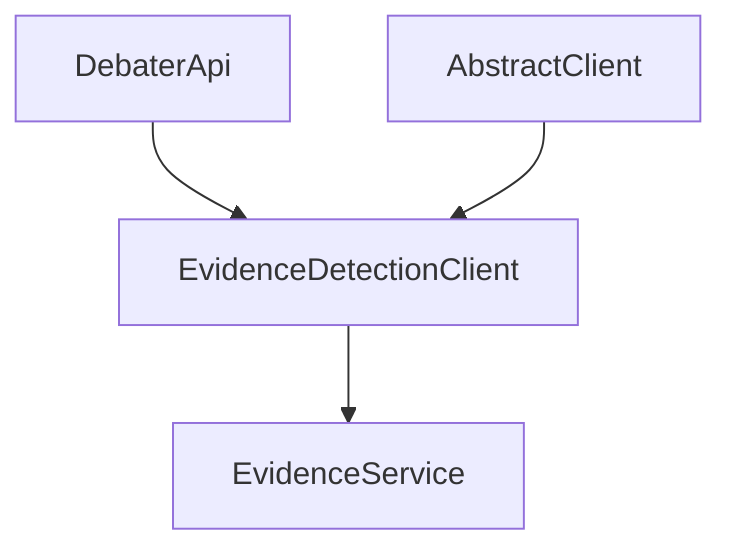

# EVIDENCE DETECTION - SELECTION PROOF

## SELECTION: Evidence Detection

This document provides proof that Evidence Detection meets all Phase 1 selection criteria (A-G).

---

## PROOF CHECKLIST

### [A] TOC Heading (>=1 relevant TOC heading)
- **H4 Heading (line 128):** `Claim and Evidence Detection Services`
- **H4 Heading (line 159):** `EvidenceDetectionClient`
- **Location:** `/workspaces/claude-quickstarts/experiments/exp-02/deep-wiki-spec-files/TOC-debater-early-access-program-sdk-H2-H4.md`

### [B] DeepWiki Section(s)
- **Section:** "Claim and Evidence Detection Services" (lines 2230-2279)
- **Section:** "EvidenceDetectionClient" (lines 2642-2652)
- **Section:** "Input and Output Formats" (lines 2654-2680)
- **Section:** "Processing Pipeline" (lines 2682-2713)
- **Section:** "Error Handling" (lines 2715-2725)
- **Section:** "Performance Characteristics" (lines 2727-2735)
- **Location:** `/workspaces/claude-quickstarts/experiments/exp-02/deep-wiki-spec-files/debater-early-access-program-sdk-Deepwiki.md`

### [C] DIAGRAMS (>=1 diagram showing structure/flow)

#### Primary Diagram: SDK Architecture Overview (lines 32-102)
**What it shows:**
- Factory pattern: DebaterApi → EvidenceDetectionClient
- Inheritance: AbstractClient → EvidenceDetectionClient
- Service connection: EvidenceDetectionClient → EvidenceService (motion-evidence.debater.res.ibm.com)



#### Secondary Diagram: Processing Pipeline (lines 2686-2711)
**What it shows:**
- Input Processing: sentence_topic_dicts → Validation → Transform
- Service Communication: Transform → BatchProcess (run_in_batch)
- Output Processing: BatchProcess → Results + Logging → Final Scores

This diagram captures the BEHAVIORAL flow:
1. Input validation (empty field checks)
2. Data transformation (dict → pairs)
3. Batch processing (inherited from AbstractClient)
4. Result aggregation and logging

### [D] Example Script
- **File:** `evidence_detection_example.py`
- **Location:** `/workspaces/claude-quickstarts/experiments/exp-02/reference-files/debater_python_api/examples/evidence_detection_example.py`
- **Lines:** 1-23
- **Key elements:**
  - Factory usage: `debater_api.get_evidence_detection_client()`
  - Input format: `[{'sentence': str, 'topic': str}, ...]`
  - Entry point: `evidence_detection_client.run(sentence_topic_dicts)`
  - Output format: list of float scores

### [E] Response Witness File
- **File:** `evidence_detection_response.txt`
- **Location:** `/workspaces/claude-quickstarts/experiments/exp-02/reference-files/debater_python_api/examples/evidence_detection_response.txt`
- **Lines:** 1-17
- **Observed structure:**
  - 4 input pairs → 4 output scores (1:1 correspondence)
  - Scores are floats in range [0, 1]
  - Output order matches input order
  - High scores (0.9989, 0.9987) for relevant evidence
  - Low scores (0.0014) for unrelated content

### [F] Client File
- **File:** `claim_and_evidence_detection_client.py`
- **Location:** `/workspaces/claude-quickstarts/experiments/exp-02/reference-files/debater_python_api/api/clients/claim_and_evidence_detection_client.py`
- **Lines:** 1-37
- **Class hierarchy:**
  - `EvidenceDetectionClient` (lines 32-35)
  - Inherits from `AbstractClient` (not `ClaimEvidenceDetectionClient` as shown in line 34)
  - Parent class `ClaimEvidenceDetectionClient` defines shared logic (lines 9-24)

### [G] Client Entry-Point Method (API Boundary)
- **Method:** `run(sentence_topic_dicts)`
- **Defined in:** `ClaimEvidenceDetectionClient` (inherited by `EvidenceDetectionClient`)
- **Location:** `claim_and_evidence_detection_client.py:13-24`
- **Signature:**
  ```python
  def run(self, sentence_topic_dicts: List[Dict[str, str]]) -> List[float]
  ```
- **Boundary abstraction:** This is the public API boundary; internally calls `run_in_batch()` from `AbstractClient`

---

## SELECTION JUSTIFICATION

Evidence Detection has a **complete "closed loop" of evidence**:

1. ✅ **TOC presence** - Listed in official table of contents
2. ✅ **DeepWiki documentation** - Comprehensive sections with intent and behavior
3. ✅ **Diagram evidence** - TWO diagrams showing architecture and data flow
4. ✅ **Working example** - 23-line runnable script
5. ✅ **Response witness** - Real output showing I/O shape and value ranges
6. ✅ **Client implementation** - Concrete Python class with clear inheritance
7. ✅ **Public API boundary** - Documented `run()` method

**Diagram strength:** The Processing Pipeline diagram (2686-2711) provides clear BEHAVIORAL requirements:
- Input validation (empty string checks)
- Data transformation (dict to pairs)
- Batch processing abstraction
- Result aggregation
- Performance logging

This is superior to prose descriptions because the diagram is unambiguous about sequencing and data flow.

---

## CONCLUSION

Evidence Detection is selected for Phase 1 implementation because all seven selection criteria (A-G) are satisfied with strong, triangulated evidence from diagrams, documentation, examples, and client code.
